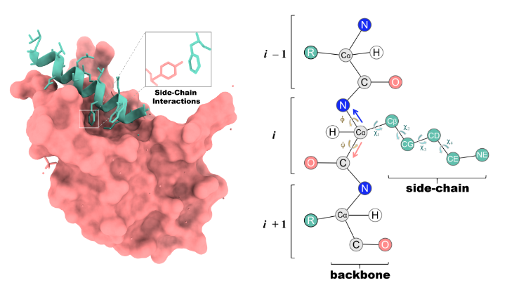
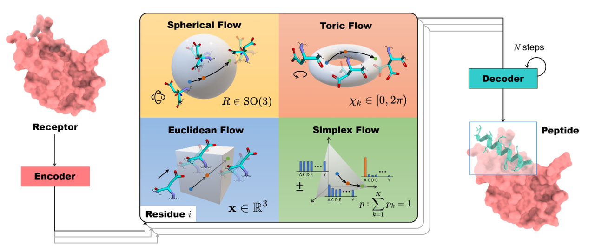

审稿人意见里面提到的一篇非常重要的文章，主要写了什么呢，一起来看看吧！

作者声称他们的pepflow是第一个用了flow matching的多模态深度生成模型，他们的目的是：在已知目标蛋白质受体的条件下，设计出相应的肽（和我们的非常类似orz

他们的动机是现有的生成模型比如Diffusion仅关注骨架设计，忽略了侧链动态和全原子结构，强调需要同时建模序列与结构、结合位点条件化生成，以及多模态联合分布的必要性。

引言部分的图片用于引出问题，左边展示的就是肽和目标蛋白的结合示意图，突出关键残基的骨架方向和侧链相互作用。右图呢说明了每个蛋白质残基包含了骨架原子和侧链原子，意思就是说肽和蛋白质相互结合的关键因素就是这俩，那在这个工作里面就要把他们考虑进去。

方法部分定义将肽的每个残基表示为刚性框架（位置和方向）、侧链角度和离散类型，并为每种模态构建分析流

肽的数学表示：残基类型（$$a^i$$）、骨架刚体变换（$$R^i,x^i$$）、侧链扭转角（$$χ$$），并建模条件分布$$p(C^{pep}∣C^{rec})$$。

他这里的多模态是这样定义的，在四个维度进行建模：位置、方向、角度、类型

- **位置（Position, Euclidean CFM）**：使用欧几里得流匹配（线性插值）。

- **方向（Orientation, Spherical CFM）**：在SO(3)流形上通过测地线插值定义流。

- **角度（Angles, Toric CFM）**：在环面（$$T$$）上处理周期性角度。

- **类型（Type, Simplex CFM）**：将离散残基类型映射到概率单纯形（$$Δ^{19}$$），通过logit空间进行流匹配。

- **联合目标函数**：加权多模态损失（位置、方向、角度、类型）。

他的架构其实很简单，就是encoder和decoder，encoder是用于提取目标蛋白质的几何特征也就是编码为embedding，decoder基于Invariant Point Attention对各个模态的flow进行预测，通过欧拉方法迭代生成肽结构

实验分为三大部分：序列结构协同设计、固定骨架序列设计、侧链包装
