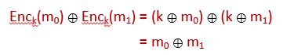

---

title: 信息安全

published: 2024-12-17

description: '信息安全笔记'

image: ''

tags: [Security]

category: '笔记'

draft: false

lang: ''

---

# Note for information security

Courses: DI31002
Data: September 15, 2024

# W1 Overview

In the first week you will be introduced to Information Security and to the assessment of security risks.

**Topic 1: Introduction to Information Security**

Reading:

· Chapter 1 of "[The basics of information security](http://www.sciencedirect.com.libezproxy.dundee.ac.uk/science/book/9780128007440)"

**Topic 2: Security Risk Assessment**

Reading:

· Chapter 25.5 of "[Security Engineering](https://www.cl.cam.ac.uk/~rja14/Papers/SEv2-c25.pdf)" Second Edition (pages 846 - 848)

· OWASP [Risk Rating Methodology](https://www.owasp.org/index.php/OWASP_Risk_Rating_Methodology)

**Lab 1: Writing a Virus**

In this week's lab you will form study groups and write a script virus.

**Weekly Class Test**

The class test covering this week's topics (worth 2% of the module mark) will be at **on Friday 13th September (Week 2).**

## Tutorial

[**Lab 1**](https://www.notion.so/Lab-1-10280b25e4c2804cbd98e29c26e342bb?pvs=21)

### General Definitions

**Cybersecurity** deals with prevention and detection of improper actions by users of **information systems**. 只关于信息系统

**Information security** is more general: it deals with the proper use of information, independent of computer systems. Information security is defined as “**protecting information and information systems from unauthorized access, use, disclosure, disruption, modification, or destruction.**” 更加宽泛

### CIA

**Confidentiality 机密性**

Confidentiality is a concept similar to, but not the same as, privacy. Property that information is not made available or disclosed to unauthorised entities.

**Integrity**

Integrity refers to the ability to prevent our data from being changed in an unauthorized
or undesirable manner. Property of accuracy and completeness.

**Availability**

Availability refers to the ability to access our data when we need it. Property of being accessible and usable upon demand by an authorised entity.

### Threats, vulnerabilities, and risk

**Threat:** Potential cause of an unwanted event that may harm assets. (external)

**Vulnerability:** A characteristic of a system that can be exploited by a threat. (internal)

**Risk:** Possibility to suffer harm or loss. A function of loss associated with an event and probability that event occurs.

Working definition for risk associated with vulnerabilities:

risk = (impact to asset from exploit of vulnerability) x (probability of occurrence)

### What must we know to assess a system’s security?

What are we protecting? (asset)

Who is the attacker? (threat agent)

What are the threats?

What are the vulnerabilities?

What are effective defence mechanisms? (countermeasure)

### Threat Agents: Skills, Motives and Opportunity (Size matters, too)

external attackers, inside attackers, script kiddies, organised criminals, competitors, nation states, accidental, intentional actors

### Dealing with security

### **Risk Mitigation**

1. Prioritise the risks
2. Identify countermeasures
3. Evaluate the countermeasures:
   1. How well do they reduce the risk?
   2. How expensive are they?
   3. What trade-offs and new risks do they bring?
4. Implement countermeasures

### **Policy Compliance**

1.Specify what the system should do.

2.Design and implement a system that meets the specification in the intended environment.

3.Security specification states what system behaviours are acceptable/unacceptable.

**Specification:** What is the system (not) supposed to do?

Given by a security policy*,* often formulated to achieve standard security properties (CIA).

**Implementation:** How does it do it?

Consists of security mechanism to enforce the security policy.

**Correctness:** Does it really work? (Is it “secure” in the intended environment?)

Provides assurance by demonstrating compliance with the security policy.

# W2 Overview

This week you will be introduced to cryptography, perfect secrecy, and the security of encryption schemes.

**Topic 3: Introduction to Cryptography**

- Introduction to Cryptography
- Perfect Secrecy
- Threat Models
- Security of Encryption Schemes

Reading:

- Chapter 1 of "[Introduction to Cryptography](https://link.springer.com/book/10.1007%2F978-3-662-47974-2)"
- Chapter 5 of "[The basics of information security](http://www.sciencedirect.com.libezproxy.dundee.ac.uk/science/book/9780128007440)"
- Chapter 5 of "[Security Engineering](https://www.cl.cam.ac.uk/~rja14/Papers/SEv2-c05.pdf)" Second Edition

**Lab 2: Modular Arithmetic**

[**Lab 2**](https://www.notion.so/Lab-2-f272e11b6d6c4e14a3b26bb13ea95ec9?pvs=21)

**Class Test**

## Tutorial

### Formal Definition of Encryption Scheme

An *encryption scheme* (or cipher) is a pair of algorithms (Enc, Dec)*,* where

Enc : ***K** × **M** → **C**,*    Dec : ***K*** × ***C*** *→ **M***,    and

Enc and Dec satisfy the following correctness condition:

for every **k** in ***K***:  Dec(**k**,Enc(**k**,**m**)) = **m**.

**Terminology:**

- Enc is called the *encryption* algorithm
- Dec is called a *decryption* algorithm
- ***K*** is the set of *keys*
- ***M*** *is* the set of *plaintexts*
- ***C*** *is* the set of *ciphertexts*

**Notation:**

- We also write Enck(m) and Deck(c) for Enc(k,m) and Dec(k,c).

### Perfect Secrecy (simplified, informal definition)

*An encryption scheme is perfectly secret, if the adversary learns **no additional information** about the plaintext after observing the ciphertext.*

### Shift Cipher

**Example**:

The ciphertext is **c** = **K.**

****We do not know the key **k**.

What is the plaintext **m**?

The shift cipher provides perfect secrecy as long as at most one letter is encrypted with a randomly chosen key.

### The One-Time-Pad

**Idea:** We shift each letter of the plaintext by a fresh, randomly chosen number of positions in the alphabet.

Every plaintext of the same length as **m** can be encrypted to the same ciphertext **c** with a suitable key.

The One-Time-Pad -if used correctly- provides perfect secrecy!

**The One-Time-Pad provides perfect secrecy:**

- even against adversaries with infinite computational resources.

**But**:

- The key must be **chosen uniformly at random** from the set of keys ***K***.
- The key **must not be reused.**

The drawbacks:

1. The key has to be as long as the message.
2. It is very difficult to generate truly random strings.
3. The key cannot be reused.

Optimality of the One-Time Pad

If (Enc, Dec) is a perfectly secret encryption scheme

Enc : ***K*** *× **M** → **C*** , Dec : ***K*** × ***C*** *→ **M***

then **|*K*|** *≥* **|*M*|**.

The one-time pad is optimal among perfectly secret schemes, because the size of its key space is equal to the size of the plaintext space.

**Computational secrecy:**

**m** and **Enck(m)** are independent  **“from the point of view of a computationally  limited adversary’’.**

### Ciphertext-Only Attack on Shift Cipher

The shift cipher with the given plaintext set is not secure against ciphertext-only attacks. The adversary *can* do better than random guessing, by computing the shift from V to the first letter of the ciphertext.

The shift cipher with this plaintext, ***M*** **= { ABC, DEF, GHI }**, set *is* secure against ciphertext-only attacks. The adversary *cannot* do better than random guessing, as for every possible key, all three possible plaintexts are equally likely.

The substitution cipher with the given plaintext set is **not** secure against ciphertext-only attacks. The adversary ***can*** do better than random guessing, by checking whether the second and fourth letter of the ciphertext are the same. While there is uncertainty whether a ciphertext decrypts to **VIDI** or **VICI**, this is better than random guessing (1/2 instead of 1/3).

### Semantic Security

The encryption scheme (Enc, Dec) is semantically secure if the adversary cannot do better than random guessing.

### Chosen-plaintext attack(CPA)

IND-CPA Security

**Definition:** We say that **(Enc, Dec)** has **indistinguishable encryptions under a chosen-plaintext attack (IND-CPA)** if every randomized polynomial time adversary guesses **b** correctly in the CPA game with probability at most **0.5 + ε(n),** where **ε** is negligible.

In other words: The encryption scheme is CPA-secure if a computationally bounded adversary cannot do better than random guessing.

**ciphertext-only attack** – the adversary has no information about the plaintext.

**known plaintext attack** – the adversary learns the plaintext, but they are drawn from some distribution that the adversary does not control.

**chosen-plaintext attack** – the adversary chooses the plaintexts.

**chosen ciphertext attack** – the adversary may additionally query a decryption oracle.

# W3 Overview

You will learn about stream ciphers, block ciphers, and hash functions.

**Topic 4: Stream Ciphers**

Pseudorandom Generators

Stream Ciphers

Reading:****

- Chapter 2 of "[Introduction to Cryptography](https://link.springer.com/book/10.1007%2F978-3-662-47974-2)" (up to and including 2.1.1)

**Topic 5: Block Ciphers**

Block Ciphers

Reading:

- Chapter 2 of "[Introduction to Cryptography](https://link.springer.com/book/10.1007%2F978-3-662-47974-2)" (Section 2.1, starting from 2.1.2)

**Topic 6: Hash Functions**

Hash Functions

Reading:

- Chapter 2 of "[Introduction to Cryptography](https://link.springer.com/book/10.1007%2F978-3-662-47974-2)" (Section 2.2)

**Lab 3: openssl and GnuPG**

**Class Test**

## Tutorial

### Pseudorandom number generators (PRNGs)

The PRNG G(s) stretches the seeds’ randomness

PRNGs can shorten the length of the **key** in the one-time pad

In practice, it must pass the **next-bit test:**    given the first k bits of a random sequence, there is no    polynomial-time algorithm that can predict the (k+1)th    bit with probability of success better than 50%.

### Stream Ciphers

The PRNGs used in practice are called stream ciphers. 

They are called like this because their output is an “infinite” **stream** of bits.

Historical stream ciphers:

- Based on **liner feedback shift registers**:
  - **A5/1** and **A5/2** used to encrypt  mobile phone (GSM) communication. (completely broken)****
  - **Content Scramble System (CSS)** encryption used to encrypt Movies on DVDs. (completely broken)
- Other:
  - **RC4** used, e.g.,  to encrypt WiFi communication (WEP, WPA) and SSL/TLS  communication. (very popular, has serious security weaknesses)

**RC4:**

- Designed by **Ron Rivest** (**RSA Security**) in 1987.  **RC4** = “**Rivest Cipher 4**”, or “**Ron's Code 4**”.
- Trade secret, but its description was leaked in  September 1994 on Usenet.
- For legal reasons it is also called "**ARCFOUR**" or “**ARC4**“.
- Used in **WEP** and **WPA** and **SSL/TLS**.
- **Very efficient and simple**, but has some **security flaws.**

### Block Ciphers

Terminology

**stream ciphers ≈ pseudorandom generators**

**block ciphers** **≈** **pseudorandom permutations**

Popular block Ciphers:

**Problems:**

1.The messages have to be short.

2.How to encrypt multiple messages? A permutation is **deterministic** and **has no state**, so this **cannot be CPA-secure.**

Block ciphers **cannot be used directly for encryption**.

They are always used in some “**mode of operation**”

1.**Electronic Codebook (ECB)** mode,

2.**Cipher-Block Chaining (CBC)** mode,

3.**Counter (CTR)** mode,

**Output Feedback (OFB)**mode

**ECB mode:**

**Not CPA-secure. Should not be used.**

**CBC mode:**

properties:

1. if there is an error in one block, it will only affect this block and the next
2. if one bit of plaintext is changed, everything needs to be recomputed
3. encryption can not be parallelized
4. decryption can be parallelized

**Counter (CTR) mode**

We have to be sure that **IV + i** never repeats.

This is why it is bad if the block length is too small (like in **DES**).

properties:

1. if there is an error in one block, it will only affect this block
2. if one bit of plaintext is changed, only one block needs to be recomputed
3. encryption can be parallelized
4. decryption can be parallelized

**DES** (Digital Encryption Standard)

- **Key length**:
  
    effective: **56** bits
  
    formally: **64** bits (**8** bits for parity checking)

- **Block length**: **64** bits

Critcism of DES:

- The key is too short (only **56** bits).
- Unclear role of **NSA** in the design

Security of DES:

The main weakness are

- the **short key** (**brute-force** attacks are possible)
- and the **block length is too small**.

Apart from this it is a very secure **design.** After more than **4 decades**, the most practical attack is still by **brute-force**!

The other known attacks so far

- **differential cryptanalysis** and
- **linear cryptanalysis**

are rather theoretical.

**AES (Advanced Encryption Standard)**

- Competition for **AES** announced in **January 1997** by the US **National Institute of Standards and Technology** (NIST)
- **15** ciphers submitted
- **5** finalists: MARS, RC6, Rijndael, Serpent, and Twofish
- **2 October 2000**: Rijandel selected as the winner
- **26 November 2001**: **AES** becomes an official standard
- Authors : Vincent Rijmen, Joan Daemen (Belgium)
- Key sizes: 128, 192 or 256 bit, block size: 128 bits

### Hash functions

A **hash function** maps a string of **arbitrary length** (called a **message**) to a string of **fixed length** (called a **message digest** or **hash**).

Used in …
encryption schemes,
digital signatures,
password databases,
proof-of-work computations (blockchain),

Map arbitrary input strings to fixed length output such that the mapping is:

**Preimage resistant:** Given a hash value it is difficult to find a corresponding input.

**Collision resistant**: It is difficult to find a *collision*: two distinct inputs that hash to the same output value.

**Popular hash functions**:

→**MD5** (now considered broken) (128 bit hash values)

→**SHA1** (broken, too) (160 bit hash values)

→SHA2 family: **SHA224, SHA256, SHA384, SHA512**

→SHA3 family: **SHA3-224, SHA3-256, SHA3-384, SHA3-512**

**Notes:**

→MD5, SHA1, and the SHA2 family are all based on the same design (Merkle-Damgård construction).

→SHA3 is not a replacement for SHA2, but a different design.

→SHA3 is not implemented in OpenSSL (up to version 1.1).

A hash function **H** is:

- **collision resistant** if it is hard to find any pair **(m,m’)** such that **H(m) = H(m’)**.
- **pre-image resistant** if **given H(m)** it is hard to find **m’** so that **H(m) = H(m’)**.
- **second pre-image resistant** if **given m** it is hard to find **m’ ≠ m** so that **H(m) = H(m’)**.

MD5 (Message-Digest Algorithm 5)

SHA-1 (Secure Hash Algorithm)

SHA-3

# W4 Overview

In this section you will learn about passwords and message authentications codes (MACs).

**Topic 7: Passwords**

**Topic 8: Message Authentication Codes (MACs)**

Reading:

- Chapter 2, Section 2.2 of "[Introduction to Cryptography](https://link.springer.com/book/10.1007%2F978-3-662-47974-2)"

**Lab: Applied Cryptography (for Assignment 1)**

This lab is time for you to work on your Applied Cryptography assignment.

**Class Test**

## Tutorial

### Passwords

How to protect the passwords in a database?

- **Storing plaintext passwords is bad** because passwords are not protected from curious system administrators, intruders, database leaks, etc.
- Can passwords be encrypted? How is the system going to authenticate its users? Where is the decryption key stored?
  - Key could be stored in a **hardware security module** (HSM). We’ll get back to that.
  - Instead of encrypting the password, you encrypt a fixed string.  The **password is the encryption key**!  **Downside**: The passwords’ **length is limited** by the key length.
  - **Alternative: Hash** the passwords.

Complex password rules

**basic8/16:** Password must be at least 8/16 characters long.

**dictionary8:** … must not be a dictionary word and at least 8 characters long.

**comprehensive8:** … must not be a dictionary word, at least 8 characters long, and contain lowercase letter, uppercase letter, symbol, and digit.

Protecting Password Databases - Summary

- Passwords need **salt**! Instead of storing h(pw) the database must store z and h(z,pw), where z is a random **number** (the salt) for the user and pw is the user’s password.
- SHA-256, SHA-3, …, by themselves make for poor password hash functions because they are too efficient. A password hash function should be **inefficient** with adjustable work parameter, such as bcrypt or PBKDF2.
- Even better: scrypt and Argon2 additionally  require a large amount of **memory**  ****preventing parallelised attacks.

### Message Authentication Codes

Formal Definition of MAC Scheme

A *message authentication code* (or MAC) *scheme* is a pair of algorithms (tag, vrfy)*,* where

tag : ***K** × **M** → **T**,*    vrfy : ***K*** × ***M*** × ***T*** *→* { *true, false* },

and tag and vrfy satisfy the following correctness condition:

for every **k** in ***K,* m** in ***M***:  vrfy(**k**,**m**,tag(**k**,**m**)) = *true*.

tag is called a *tagging* algorithm,

vrfy is a *verification* algorithm,

***K*** is the set of *keys*,****

***M*** the set of *plaintexts*, and

***T*** the set of *tags*.

**Informal security definition:** We say that the adversary breaks the MAC scheme if at the end she outputs (m’,t’) such that

**vrfyk(m’,t’) = true    and     m’ ≠ m1,…,mw.**

**Constructing MACs from Hash Functions**

Establishing Secure Channels

1. Encrypt and MAC

Considered bad design, because it may reveal information about the plaintext.

Used for example in SSH.

1. MAC then Encrypt

Ciphertext not integrity protected. May be vulnerable to padding oracle attacks in some settings.

Used in SSL/TLS which was vulnerable to a padding oracle attack (“Lucky Thirteen”) that has been fixed since.

1. Encrypt then MAC

Considered stronger than the other two methods, but is not foolproof!

Used in IPSec, extensions of TLS and SSH (OpenSSH).

Authenticated encryption

GCM

# Week5 Overview

## Tutorial

### Injection attack

malicious data is sent to an interpreter as part of a command or a query.

Examples: SQL, OS, LDAP injections.

Related: buffer and heap overflow attacks, XSS.

### SQL Injection

Can be used to

- steal contents of databases (passwords, credit card numbers, user data)
- modify contents of databases (delete all contents)
- get unauthorised access to resources.

### How to defend against SQL injections

Using prepared statements

- create a “template” statement
- insert the data
- do the statement

Using stored procedures:

- store a collection of statements in the database
- these can be executed and return a result
- these are language independent
- can result in reduced network traffic

### Cross-site Scripting (XSS)

A type of injection attack, in which malicious scripts are injected into trusted web sites.

Malicious scripts is executed in victim’s browser

Attacker can steal information (cookies, credentials, …), spy on the user (install key logger), modify the webpage contents to perform phishing attacks

### XSS Cast

Attacker: injects malicious script through a form, embedded in a link, etc.

Web server: trusted by client/victim answers request from client, ends up sending attacker’s malicious script, too.

Client/victim’s browser trusts server, executes malicious script that it receives.

4 types:

- stored server XSS
  - This is the classic XSS attack type.
  - Malicious **user input** is **stored on the target server** (e.g. database or message forum). Client receives the stored data from the server without that data being made safe to render in the browser.
- stored client XSS
  - Malicious **user input** is **displayed by the client’s browser** (added to DOM). Data is not stored and may not be sent to the server.
- reflected server XSS
  - Malicious **user input** is **stored in the client’s browser** (e.g., added to HTML5 localStorage). Data may not be sent to the server.
- reflected client XSS
  - Malicious **user input** is **received** **by the target server** and **sent back** to the browser (e.g. error or confirmation message). Client receives the data from the server without that data being made safe to render in the browser.

### Defending against XSS

- User input must be securely handled in both  **server-side code** and **client-side code**!
- Stored and reflected XSS are countered by  the same defensive mechanisms.
- Test your code for XSS vulnerabilities.
- **Server XSS:**
  - First line of defence: Use **context-sensitive** (server side) **output encoding** with a secure encoding library, e.g. [https://github.com/OWASP/owasp-java-encoder](https://github.com/OWASP/owasp-java-encoder)
  - Good, but has limitations: **Input Validation**. Filter user input so that the browser does not interpret it as code. Use **whitelists** of safe tokens instead of blacklists of unsafe tokens.
- **Client XSS:**
  - Best: Avoid client-side document rewriting, generate dynamic pages server-side.
  - Use **safe JavaScript APIs/methods**
  - **Input Validation**: As above
  - **Context-sensitive output encoding** (in the browser) before calling unsafe JavaScript methods

### Cross-site request forgery (CSRF)

- User/victim is authenticated to server and in a session with server.
- User clicks on a link (or requests a resource) provided by an attacker. The user’s browser interprets the provided resource and connects to server.
- Server cannot distinguish between a malicious and a genuine request as both are received from the same browser.
- CSRF’s purpose is to cause a state change in the server, as the attacker cannot directly observe the outcome.

### CSRF Cast

Attacker: provides script or a link with malicious side-effects for victim.

Client/victim’s browser acts on script/accesses provided link thus asking server to perform an unwanted action.

Web server: executes client/victim’s request, performs attacker’s requested state change.

### Difference between XSS and CSRF

- XSS: Browser executes malicious injected code.
- CSRF: Server receives malicious request from browser and acts on it.

### Defend against CSRF

- Server cannot distinguish whether browser is making a request on user’s or attacker’s behalf.
- Using POST instead of GET requests does not protect from malicious websites that submit hidden forms to victim’s session with server.
- Valid requests for critical state changes (e.g. money transfers) **must include unpredictable tokens**. This can be done with a challenge-response mechanisms.
- Protect yourself: Do security-critical thing in one browser without multitasking. Logout, quit browser, then go back to surfing dark corners of the net (on a different machine).

### Active data uploads

This is just another form of user-provided input.

- You allow data to be uploaded to your site, e.g. image files.
- An attacker notes your site uses php, java, …
- Attacker uploads an active file, e.g., myload.php
- Your server saves it.
- Now attacker runs

### Protecting against active data upload

- Put any uploads outside of the path to the document root.  This prevents the attacker from directly accessing the file.  The file is streamed on request rather than executed.
- Create a new, unpredictable file name.  This allows for an easy validation of file names.  Original names can be stored in a lookup table.

### General principles and countermeasures:

- **Treat all input as evil.**
- Separate data and code.
- Use white-lists (rather than black-lists) where possible.
- Validate (rather than sanitise) input.
- Encode output generated from user-supplied input  in a context-sensitive manner.

### Denial of Service (DoS)

- Class of attacks on **availability** of a service.
- 2 options to attack availability:
  - Break the service.
  - Overload the service / starve it of a resource.

### Break the Service

- Ping of death: send malformed (e.g., larger-than-expected) packet to crash the victim’s service.
- Permanent DoS: Exploit security flaw to replace a device’s firmware with non-functional firmware.

### Overload/Starve the Service

Attacker makes service unavailable to legitimate users by **overloading** the **service** or starving it of a resource with bogus requests **so that legitimate requests cannot be served**.

Techniques:

- Consume too much bandwidth.
- Create too many requests.
- Create time-consuming requests.
- Make the service hard to reach by  overloading a nearby router with bogus requests.

### Distributed Denial of Service (DDoS)

- Popular form of Denial of Service attacks, where many, distributed willing or unwilling participants contact victim.
- Frequently carried out using **botnets**. To build a botnet:
  - Find wide-spread vulnerability.
  - Exploit it, install your code (turning it into a “bot”).
  - Let bots turn more vulnerable machines into bots
- DDoS Attack: Instruct bots to request a service from the victim.
- Early days’ botnets consisted of Windows PCs, nowadays it’s  Internet of Things devices.
- Botnets’ peak network traffic during attacks:  2002: 1.2 Gbit/s, 2006: 24 Gbit/s, 2013: 600Gbit/s, 2016: 1 Tbit/s

### Defences

- Distributed replication: **Replicate** service **with different**, functionally similar **technologies**.
  - Use different **hardware** vendors for your routers, servers, hard disks, …
  - Run different **operating systems**,
  - Install different **applications** e.g., mysql vs postgres vs …, apache vs nginx vs …, PHP vs Java…
- (Local) **Monitoring** & **Filtering** with Routers/Switches
  - rate limiting
  - simple request filtering (based on IP addresses, particular request strings)
  - filtering after deep packet inspection
- **Upstream filtering**: Traffic is first passed through a cleaning centre (e.g., CloudFlare, Incapsula, …) and then passed on to the server.
- **Puzzles** and cookies (e.g. [https://tools.ietf.org/html/rfc8019](https://tools.ietf.org/html/rfc8019))
  - Protects server by requiring that client spends time solving a hash puzzle whose solution is easy to verify for the server.

### IoT Security

- Cheap IoT devices are frequently full of security vulnerabilities.
- Many of these devices will never receive security updates.
- This poses a threat to all devices that are on the same network and in some cases to the Internet at large (due to DDoS attacks for example).
- Bruce Schneier: “The market can’t fix this because neither the buyer nor the seller cares.”

# Week6 Overview

## Tutorial

### Secret Key Distribution

- **Pre-deploy pairwise keys**

drawbacks:

A quadratic number of keys is needed:

- High storage and deployment costs.
- Key distribution, key revocation, and key rotation for one user affect all users.
- **Key Distribution Centers**

Some *server,* a **Key Distribution Centre** (KDC) “gives the keys” to the users on the fly.

- **Feasible** if the users are working in one company.
- **Infeasible** on the Internet.
- Relies on the honesty of KDC**.**
- KDC needs to be  permanently available.

### Public-Key Cryptography

### One-way functions

One-way functions are **easy to compute**, but **hard to invert**.

We do not know whether one-way functions exist, but we have a few **candidates:**

- Pre-image resistant hash functions
- Multiplication of two large prime numbers
- Discrete Exponentiation  (e.g., exponentiation modulo  a large prime number)

### Symmetric and Asymmetric Encryption

Symmetric encryption: One key is used for both encryption and decryption.

Asymmetric encryption: A **public key** is used to encrypt, and a different, **private key** is used to decrypt.

Public key: To be distributed publicly. Used to encrypt messages

Private key: Must be kept secret. Used to decrypt cipher texts.

### Group and Generator

### 📚 **群（Group）的概念解释**

在数学中，**群（Group）** 是一个代数结构，满足特定的性质。图中展示的是在模 11 下的乘法群 $(\mathbb{Z}_{11}^*)$。

---

## 🔑 **群的定义**

一个**群**是一个集合 $G$和一个二元运算（例如加法或乘法），满足以下四个性质：

1. **封闭性（Closure）**
   - 对于任意两个元素 a,b 属于 G，它们的运算结果 a⋅b 也属于 G。
2. **结合性（Associativity）**
   - 对于任意三个元素 a,b,c 属于 G，有：

$(a \cdot b) \cdot c = a \cdot (b \cdot c)$

1. **单位元（Identity）**
   - 存在一个元素 e 属于 G，使得对于任意元素 a 属于 G：

$a \cdot e = e \cdot a = a$

1. **逆元（Inverse）**
   - 对于任意元素 a 属于 G，存在一个元素 a−1 属于 G，使得：

$a \cdot a^{-1} = a^{-1} \cdot a = e$

---

## ⚙️ **图中群** $\mathbb{Z}_{11}^*$**的解释**

- **集合**： $\mathbb{Z}_{11}^* = \{1, 2, 3, 4, 5, 6, 7, 8, 9, 10\}$
  - 这是在模 11 下所有与 11 互质的整数。
  - 排除了0，因为0没有乘法逆元。
- **运算**：模 11 下的**乘法**。
- **单位元**：1（在乘法下，1是单位元）。
- **逆元**：每个元素都有一个逆元。例如：
  - $2 \cdot 6 \equiv 1 \pmod{11}$ → 2 和 6 是彼此的逆元。
- **生成元（Generator）**：
  - 图中显示，**2 是一个生成元**，因为通过 2 的幂次方可以生成整个集合 $\mathbb{Z}_{11}^*$。
  - 例如：$2^1 = 2, 2^2 = 4, 2^3 = 8, \ldots$

---

## 🧠 **总结**

- **群** 是一个满足**封闭性**、**结合性**、**单位元**和**逆元**的集合。
- 在模11下， $\mathbb{Z}_{11}^*$是一个乘法群。
- **2 是这个群的生成元**，可以通过幂运算生成所有元素。
- 在密码学中，生成元和群的性质广泛用于**离散对数问题**和**ElGamal加密**。

### 📚 **Diffie-Hellman密钥交换（Diffie-Hellman Key Exchange, DHKE）**

**Diffie-Hellman密钥交换** 是一种密码学协议，用于**在不安全的通信信道上安全地共享密钥**，使通信双方可以在不直接传输密钥的情况下，生成一个共享的**对称密钥**。

---

## ⚙️ **1. 背景与目的**

- **目的**：在公开信道上，Alice 和 Bob 希望共享一个**私密密钥**，但不希望这个密钥被第三方（如窃听者 Eve）获取。
- **核心问题**：双方在公开信道上交换数据时，如何保证窃听者无法轻易计算出共享密钥？
- **解决方案**：使用**离散对数难题（Discrete Logarithm Problem, DLP）**。

---

## 🛠️ **2. Diffie-Hellman协议的工作原理**

### **公共参数（Public Parameters）**

1. **一个素数 p**：所有计算都在模p的有限域上进行。
2. **一个生成元 g**：一个小于 p的整数，通常称为**基数**，是 p 的原根。

这些参数 (p, g) 是**公开的**。

---

### **步骤**

### **🧑‍💼 Alice：**

1. 选择一个**私钥** a（随机选择，a保密）。
2. 计算: $A = g^a \mod p$
3. 将A**发送给 Bob**。

### **🧑‍💼 Bob：**

1. 选择一个**私钥** b（随机选择，b保密）。
2. 计算: $B = g^b \mod p$
3. 将B**发送给 Alice**。

### **🔑 共享密钥生成：**

- **Alice** 计算共享密钥：
  
    $K = B^a \mod p$

- **Bob** 计算共享密钥：
  
    $K = A^b \mod p$

**数学原理**：

$B^a \mod p = (g^b)^a \mod p = (g^a)^b \mod p = A^b \mod p$

**结果**：Alice 和 Bob 都得到了**相同的共享密钥 K**，而第三方（Eve）即使截获了 g、p、A 和 B，也难以计算出 KK。

---

## 🛡️ **3. 安全性**

### **离散对数难题（Discrete Logarithm Problem, DLP）**

- 知道 g, p 和 $g^a\mod p$之后，计算 a（Alice的私钥）是非常困难的。
- 如果素数p  足够大，攻击者无法在合理时间内求解 a 或b。

### **中间人攻击（Man-in-the-Middle Attack, MITM）**

- 如果通信信道不安全，攻击者可能冒充 Alice 和 Bob，分别与他们建立独立的密钥。
- **解决方案**：使用**数字签名**或**公钥基础设施 (PKI)** 来验证对方身份。

---

## 🧠 **4. 举例**

假设：

- p=23, g=5

- **Alice选择私钥** ：
  
    a=6
  
    $A = 5^6 \mod 23 = 8$

- **Bob选择私钥** ：
  
    b=15
  
    $B = 5^{15} \mod 23 = 19$

**交换密钥**：

- **Alice计算共享密钥**：
  
    $19^6 \mod 23 = 2$

- **Bob计算共享密钥**：
  
    $8^{15} \mod 23 = 2$

**最终共享密钥为**：`2`

即使 Eve 知道 5、23、8 和 19，也无法轻易计算出密钥。

---

## ✅ **5. 总结**

1. **公共参数**：p 和 g 是公开的。
2. **私钥**：Alice 和 Bob 分别选择私钥 a 和 b。
3. **共享密钥**：双方独立计算，最终得到相同的密钥。
4. **安全性依赖**：离散对数难题。

---

### 📚 **ElGamal 解密示例（ElGamal Decryption Example）**

ElGamal 加密系统是一种**公钥加密算法**，用于安全地传输加密消息。它基于**离散对数问题**的难解性，确保通信的安全性。

---

## ⚙️ **1. ElGamal 密钥系统**

### **密钥生成**

- **公开参数**：p（素数），g（生成元）。

- **私钥**：b（随机选择，保密）。

- **公钥**：
  
    $y = g^b \mod p$

### **加密**

- 明文：m

- 随机数：a（每次加密时随机选择，保密）

- **密文**：
  
    $(c_1, c_2)$
  
  - $c_1 = g^a \mod p$
  - $c_2 = m \cdot y^a \mod p$

### **解密**

- 接收密文 $(c_1, c_2)$

- 使用私钥 b 解密：
  
    $m = c_2 \cdot (c_1^b)^{-1} \mod p$

其中, $(c_1^b)^{-1}$ 是 $c_1^b$ 关于模 $p$ 的**乘法逆元**。

---

## 🛠️ **2. 解密示例**

### **已知参数**

- **素数**：
  
    p=17

- **生成元**：
  
    g=3

- **私钥**：
  
    b=6

- **公钥**：
  
    $y = g^b \mod p = 3^6 \mod 17 = 15$

- **密文**：
  
    $(c_1, c_2) = (13, 12)$

### **解密步骤**

### **Step 1: 计算** $c_1^b \mod p$

$c_1^b \mod p = 13^6 \mod 17 = 16$

### **Step 2: 计算乘法逆元** $(c_1^b)^{-1} \mod p$

使用**扩展欧几里得算法**计算 $16^{-1} \mod 17$。

$16^{-1} \mod 17 = 16$

（因为 $16 \cdot 16 \mod 17 = 1$）

### **Step 3: 计算明文 m**

$m = c_2 \cdot (c_1^b)^{-1} \mod p$

代入数值：

$m = 12 \cdot 16 \mod 17 = 5$

**解密结果**：明文为 **5**

---

## ✅ **3. 总结**

1. **接收密文**：
   
    $(c_1, c_2)$

2. **使用私钥** $b$ **解密**：
   
    $m = c_2 \cdot (c_1^b)^{-1} \mod p$

3. **计算逆元**：使用**扩展欧几里得算法**

4. **成功还原明文**

**ElGamal 解密的核心安全性依赖于离散对数问题的计算困难性。**

---

# 📚 **乘法逆元与欧几里得算法、扩展欧几里得算法**

在密码学、数论以及算法设计中，**乘法逆元** 和 **欧几里得算法** 是非常重要的数学工具，尤其在**RSA** 和 **ElGamal** 等加密算法中起着关键作用。

---

# ⚙️ **1. 乘法逆元 (Multiplicative Inverse)**

### **定义**

对于一个正整数 $a$ 和一个模数 $m$，如果存在一个整数 $x$，使得：

$a \cdot x \equiv 1 \mod m$

那么我们称 $x$ 是 $a$ 关于模 $m$ 的**乘法逆元**，记作：

$a^{-1} \mod m$

### **存在条件**

当且仅当 $a$ 和 $m$ **互质**（即 $\gcd(a, m) = 1$），乘法逆元才存在。

### **例子**

求 $3$ 在模 $7$ 下的乘法逆元。

- 我们要找到一个 $x$ ，使得
  
    $3 \cdot x \equiv 1 \mod 7$

- 答案是 $x = 5$ ，因为
  
    $3 \cdot 5 = 15 \equiv 1 \mod 7$

---

# 🛠️ **2. 欧几里得算法 (Euclidean Algorithm)**

### **定义**

欧几里得算法是一种**高效计算两个整数最大公约数（GCD）** 的方法。

它基于以下公式：

$\gcd(a, b) = \gcd(b, a \mod b)$

### **步骤**

1. 将较大的数 a 对较小的数 b 取模，得到余数r 。
2. 将 b 赋值给a ，将 r 赋值给b。
3. 重复以上步骤，直到余数为0 。此时，最后一个非零余数就是 $\gcd(a, b)$。

### **例子**

求 $\gcd(30, 18)$：

1. $30 \mod 18 = 12$
2. $18 \mod 12 = 6$
3. $12 \mod 6 = 0$

**最大公约数是 6**

---

# 🔄 **3. 扩展欧几里得算法 (Extended Euclidean Algorithm)**

### **定义**

扩展欧几里得算法不仅可以求两个整数的最大公约数，还可以找到贝祖等式（Bézout's Identity）的解：

$a \cdot x + b \cdot y = \gcd(a, b)$

### **应用**

- 当 $\gcd(a, m) = 1$ 时，扩展欧几里得算法可以用来计算 a 关于模 m 的**乘法逆元**。

### **步骤**

1. 使用**欧几里得算法**计算最大公约数，同时回溯计算出系数 x 和 y 。
2. 当 $\gcd(a, m) = 1$ 时，模 m 下的乘法逆元为：

$a^{-1} \equiv x \mod m$

### **例子**

求 3 在模 7 下的乘法逆元。

我们要找到整数 x 和 y，使得：

$3x + 7y = 1$

### **步骤**

1. $7 = 2 \cdot 3 + 1$
2. $1 = 7 - 2 \cdot 3$

提取系数：

- $x = -2$
- 将 -2 转换为正数模：

$-2 \mod 7 = 5$

**结果**： $3^{-1} \equiv 5 \mod 7$

---

# ✅ **4. 总结**

| **算法**       | **作用**                         | **特点**    |
| ------------ | ------------------------------ | --------- |
| **乘法逆元**     | 寻找一个数在模 mm 下的逆元                | 仅当两数互质时存在 |
| **欧几里得算法**   | 计算两个数的最大公约数                    | 高效递归算法    |
| **扩展欧几里得算法** | 计算最大公约数，同时求解 Bézout's Identity | 可用来求乘法逆元  |

### **公式回顾**

- **乘法逆元**:
  
    $a \cdot x \equiv 1 \mod m$

- **欧几里得算法**:
  
    $\gcd(a, b) = \gcd(b, a \mod b)$

- **扩展欧几里得算法**:
  
    $a \cdot x + b \cdot y = \gcd(a, b)$

---

🔐 **实际应用：**

- 在**ElGamal加密** 和 **RSA算法** 中，用于计算私钥。
- 在**模运算**和**密码学**中扮演重要角色。

如果有任何细节不清楚，或者希望举更多例子，随时告诉我！😊✨

## 📚 **椭圆曲线方程**

椭圆曲线的一般形式是：

$y^2 = x^3 + ax + b$

- $x$ 和 $y$ 是曲线上的点的坐标。
- $a$ 和 $b$ 是定义椭圆曲线的常数。
- 该方程描述了一条平滑的、对称的曲线，满足一定的数学性质。

---

## ⚙️ **椭圆曲线的运算**

在椭圆曲线上，有一种特殊的加法运算，用于定义点之间的关系。图中展示了两个点 $P$ 和 $Q$ 如何通过椭圆曲线的运算得到另一个点 $P + Q$：

1. **加法规则：**
   
   - 过点 $P$ 和 $Q$ 画一条直线。
   
   - 直线会与椭圆曲线相交于第三个点。
   
   - 对第三个交点取**关于 x 轴的对称点**，即得到 。
     
       $P + Q$

2. **倍点运算（Point Multiplication）：**
   
   - $x \cdot P$ 表示将点 $P$ 在曲线上进行 $x$ 次加法运算。

---

## 🧠 **易与难的问题**

### ✅ **简单问题（Easy Problem）：**

**已知** $x$ **和** $P$**，计算** $x \cdot P$

- 这是一个**可计算的问题**，可以通过重复加法和双倍运算等算法来解决。

### ❌ **困难问题（Hard Problem）：**

**已知** $P$ **和** $Q$**，求** $x$ **使得** $x \cdot P = Q$

- 这就是**椭圆曲线离散对数问题（Elliptic Curve Discrete Logarithm Problem, ECDLP）**。
- 已知 $P$ 和 $Q$ ，找到 $x$ 是一个计算上非常困难的问题，无法在多项式时间内高效解决。
- 这个困难是椭圆曲线密码学的安全性基础。

---

## 🚀 **应用场景**

1. **加密通信（Encryption）：** 椭圆曲线用于安全的数据加密和解密。
2. **数字签名（Digital Signatures）：** 确保消息的完整性和来源的真实性。
3. **密钥交换（Key Exchange）：** 如 ECC-DH（椭圆曲线 Diffie-Hellman）密钥交换协议。
4. **区块链技术（Blockchain）：** 比特币和以太坊等加密货币使用 ECC 进行钱包地址生成和交易签名。

---

## 📚 **椭圆曲线密码学 (Elliptic Curve Cryptography, ECC) 详解**

### 🔑 **1. 什么是椭圆曲线密码学？**

**椭圆曲线密码学 (ECC)** 是一种基于**椭圆曲线数学**的公钥加密算法。它被广泛用于现代加密系统，如**SSL/TLS**协议、区块链、数字签名等。

ECC的安全性依赖于**椭圆曲线离散对数问题 (ECDLP)** 的难解性。与传统的RSA算法相比，ECC可以在**更短的密钥长度**下提供**相同的安全性**，从而提高了**效率**和**性能**。

---

### 📐 **2. 椭圆曲线的数学基础**

### **椭圆曲线方程**

椭圆曲线的标准形式为：

$y^2 = x^3 + ax + b \mod p$

- **x, y**：点的坐标

- **a, b**：常数，确定椭圆曲线的形状

- **p**：一个大质数，定义有限域的大小

- **条件**：（确保曲线没有奇异点）
  
    $04a^3 + 27b^2 \neq 0$

### **椭圆曲线上的点运算**

椭圆曲线密码学的核心是**点的加法和倍乘运算**：

1. **点加法 (Point Addition)**
   - 给定曲线上两个不同的点 $P(x_1, y_1)$ 和 $Q(x_2, y_2)$，它们的和是第三个点 $R(x_3, y_3)$。
2. **点倍乘 (Point Multiplication)**
   - 给定一个点 $P$ 和一个整数 $k$ ，计算 $kP$（即将点 $P$ 自身重复加 $k$次）。
   - 例如 $kP = P + P + \cdots + P$， (共 $k$ 次)。

### **离散对数问题 (ECDLP)**

已知：

- 椭圆曲线上的点 $P$
- 点 $Q = kP$（ 是一个私钥整数）

要求解 $k$ 是极其困难的，这就是**椭圆曲线离散对数问题 (ECDLP)**。

**ECC的安全性正是基于ECDLP的难解性！**

---

### 🛡️ **3. ECC的核心概念**

### **私钥与公钥**

- **私钥 (Private Key)**：一个随机选择的整数 $x$
- **公钥 (Public Key)**：使用点倍乘计算得到的 $xP$（ 是椭圆曲线上的一个基点）

### **加密与解密过程**

**1. Bob生成密钥对**

- **私钥：** $x$
- **公钥：** $xP$

**2. Alice加密**

- 选择一个随机数 $y$
- 计算 $yP$ 和共享密钥 $y(xP)$
- 使用共享密钥加密消息

**3. Bob解密**

- 计算共享密钥 $x(yP)$（等于 $y(xP)$）
- 使用共享密钥解密消息

> 数学原理： $y(xP) = x(yP)$
> 
> 共享密钥双方一致。

---

### ⚙️ **4. ECC的优点**

1. **更小的密钥长度**
   - ECC使用**256位密钥**可以达到与RSA**3072位密钥**相同的安全性。
2. **更高的计算效率**
   - 密钥长度较小，计算速度更快，适合资源受限的设备（如移动设备、物联网设备）。
3. **更少的存储和带宽消耗**
   - 更小的密钥意味着存储和传输需求更少。
4. **强大的安全性**
   - ECC基于ECDLP，其计算复杂度极高，安全性有保障。

---

### 🔄 **5. ECC的实际应用**

1. **SSL/TLS协议**：保障网站HTTPS连接安全。
2. **数字签名**：用于身份验证和消息完整性。
3. **加密通信**：如端到端加密（WhatsApp、Signal等）。
4. **区块链技术**：如比特币、以太坊等使用ECC进行数字签名和加密。

---

### 📊 **6. ECC与RSA对比**

| **特性**   | **ECC**  | **RSA**  |
| -------- | -------- | -------- |
| **密钥长度** | 短（256位）  | 长（3072位） |
| **计算速度** | 快        | 慢        |
| **安全性**  | 高        | 相对较低     |
| **资源消耗** | 低        | 高        |
| **应用场景** | 移动设备、IoT | 服务器、桌面系统 |

---

### 🚀 **7. ECC的安全性依赖**

1. **椭圆曲线选择**
   - 曲线参数必须经过标准化验证（如NIST推荐的曲线）。
2. **随机数选择**
   - 随机数必须足够安全，避免泄露或重用。
3. **侧信道攻击防护**
   - 防止通过物理特性（如能耗、电磁泄漏等）推断私钥。

---

### 🧠 **8. ECC的总结**

- ECC是现代密码学的重要组成部分，具有**高效性**和**安全性**。
- 其核心在于**椭圆曲线离散对数问题**的难解性。
- ECC在现代通信、数字签名和区块链等领域发挥着关键作用。

**一句话总结：**

**小密钥，大安全，ECC是现代加密技术的未来！**

---

# 6.2 The RSA Crytosystem

RSA是用三个人名字命名的