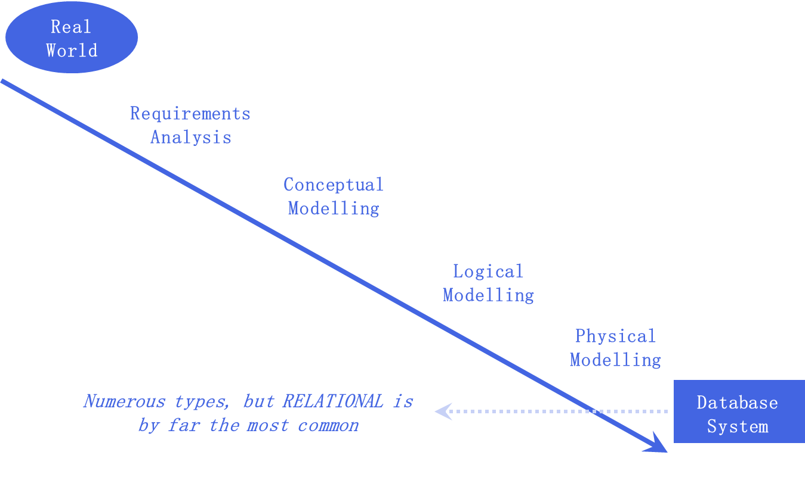

---

title: 数据库

published: 2024-12-10

description: '数据库笔记'

image: ''

tags: [Database]

category: '笔记'

draft: false

lang: ''

---

# Note for database system

Courses: DI31003
Data: September 15, 2024

# 1.1 The Nature of Data

### main content：

1. the nature of the main types of data
2. the general properties of database
   1. structured
   2. reliable/availale
   3. easily expandable/scalable
   4. searchable
   5. good usablility
   6. fast 
   7. secure
3. codd rules

## What is data?

numbers, text strings, pictures, sounds, video which have different storage requirements, display requirements, search requirements.

information is data in context

## What is a Database?

A managed data store

# 1.2 Historical Perspectives

通篇讲历史，无重点，可以有时间取瞅一眼

# 1.3 Database Design



## Modelling

### Conceptual model

- E-R models
  - entities
  - attributes
  - relationships

### Logical model - take the conceptual model and:

- nominate primary and foreign keys
- normalise (usually 3NF is enough)

### Schema - take the logical model and:

- add internal rules to create a schema
- use the schema to build the physical model

## Physical Model

We need a managed system which user can not manipulate data, maintains **integrity, security**

## User Interface

A database system is hidden, accessed via front end

### Forms

### Queries

### Reports

### SQL command interface

# 1.4 The Existence of Codd

## Hierarchical Database Model


## Network Database Model


## Codd’s Twelve Rules

He formulated 12 rules, a database may be designated as **relational** if it meets all of the fundamentals discussed in these twelve rules

### 1. Information Rule

Information is to be represented as data stored in cells, which are arranged as rows and columns.


### 2. Guaranteed access rule

Each data item must be accessible by a combination of:

→**table name** + **primary key of row** + **column name**

### 3. Nulls must be used consistently

**Nulls** are cells for which the data are **unknown**.

→nulls should simply be *missing data* and have *no values*

**一个Null不可以和另一个Null相等**

### 4. An active online data dictionary should be stored as relational tables and accessible through the regular data access language

### 5. The data access language must provide *all means* of access and be the *only means* of access

提供所有且唯一的访问途径

### 6. All views that may be updatable should be updatable

### 7. There must be set-level inserts, updates, and deletes

This is the formal mathematical basis for relational databases

### 8. Physical data independence

e.g. if a file supporting table was moved from one disk to another, or renamed, then this should have *no impact* on the application

### 9. Logical data independence

*how* a user views data should not change when the logical structure (table structure) of the database changes   

### 10. Integrity independence

integrity rules should be stored in the data dictionary
primary key constraints, foreign key constraints, check constraints, triggers etc. should all be stored in the data dictionary

**data dictionary**: the data dictionary is the schema *internal to the database*,  which describes the database structure, constraints etc   

### 11. Distribution independence

a database should continue to work properly even if *distributed*:

extension of rule 8 (physical independence) - except rather than only being distributed on a single system (locally), a database may also be distributed across a network of systems (remotely)

### 12. The non-subversion rule

when low level access is allowed, it should not bypass security nor integrity

## Terminology

In Mathematics, a relation is what is commonly called a table of data, so a **relational database is simply one in which the data is structured and stored as tables.**

# 2.1 E-R Modelling 1

## Conceptual model

Typically represented by an E-R diagram which details:

- entities (main data objects)
- attributes (properties of the entities)
- relationships (links between entities)

## Logical Model

Starts take account of the architecture.

In practice, this gives the details of the relational database:

- the details of the tables
- the details of the attributes
- the details of the primary and foreign keys
- linking tables (if required by many-many)
- normalisation

## Conceptual vs Logical

**Conceptual:**

→include important entities and relationships

→independent of database type to be implemented

→(*do not* specify attributes or primary keys)

**Logical:**

→include all entities and relationships

→specify attributes and primary keys for each entity

→specify foreign keys as required

→normalise the entities

dependent on database type to be implemented

## E-R Model

entity-relationship contains:

- entity types
- relational types

## Entity Types

Entity type:

a group of objects which have the *same properties*, identified by the client as having an independent existence, e.g. student

Entity occurrence:

a uniquely identifiable *object* of an entity type, e.g. Arthur  Wapcaplet-Smith; d.o.b. 12/10/1998

## Instance Diagrams


## Relationship Types

### Relationship type:

a set of meaningful associations among entity types
e.g. lives at

### Relationship occurrence:

a uniquely identifiable association, which includes one occurrence from each participating entity type
e.g. Fred Snooks lives at 3 High Street

## Degree of a relationship:

the number of participating entities in a relationship

### A relationship of degree:

- binary relationship called POwns


- Ternary relationship called Registers


- Quaternary relationship called Arranges


### A recursive relationship

same entity type participates *more than once* in *different* roles

relationships may be given role names to indicate the purpose that each participating entity type plays in a relationship

- Recursive relationship called *Supervises*


- Entities associated through *two distinct* relationships


### Attributes

- simple
- composite
- single-valued
- multi-valued
- derived

# 2.2 E-R Modelling 2

## Keys

### **Candidate Key**

a minimal set of attributes which uniquely identifies each occurrence of an entity type

### **Composite Key**

a candidate key which consists of two or more attributes

### **Primary Key**

a candidate key which is **selected** to uniquely identify each occurrence of an entity type. we may need to create a primary key

### **Foreign Key**

facilitate the relationship between two tables in the physical model


## **Entity Types**

strong: does not depend on other entities

weak: depend on other entities

## Structural Constraints

**The main type of constraint on relationships is called multiplicity**

The most common degree for relationships is **binary**:
Binary relationships are generally referred to as being:

- one-to-one (1:1)
- one-to-many (1:*)
- many-to-many (***:*)

Multiplicity of Staff Manages Branch (1:1) relationship


    Multiplicity of Staff *Oversees* PropertyForRent (1:*) relationship type    


Multiplicity for complex relationships:

→the number (or range) of possible occurrences of an entity type in an *n*-ary relationship when other (*n*-1) values are fixed.


Multiplicity is made up of two types of restrictions on relationships:

- Cardinality
- Participation

### **Cardinality**

Describes the maximum number of possible relationship occurrences for an entity participating in a given relationship type

### **Participation**

Determines whether all or only some entity occurrences participate in a relationship


# 2.3 E-R Modelling Problems

## Problems with E-R Models

### **fan traps**

the pathway between certain *entity* *occurrences* is ambiguous


In this diagram, we don’t know in which branch does staff SG37 work.

Reconstruction:


above: after restructuring (所以就是换了个位置?)

### **Chasm Trap**

where a model *suggests* the existence of a relationship between *entity types,* but the pathway actually does not exist between certain *entity occurrences*


*At which branch is property PA14 available?*

solve in this way: (所以就是给两个之间再加条relationship)


## **Joining Tables**

When a relationship between entities is *many:many*, the physical database will require insertion of a joining table, which will have a *one:many* relationship with each of the original entities.

This joining table *does not exist* in the conceptual model, but *should* exist in the logical model.


# 2.4 Normalisation

## Why normalisation

 While an E-R model (or paper database) may *appear* perfectly valid, quick conversion into relational database tables can potentially lead to a database which has:

- data redundancy
- poor data integrity

## Anomalies (异常)

we must avoid three database anomalies: 

- **update**

a data field is duplicated, and an update changes only one version – then how do we know which one is *correct*?

- **insertion**

existence of a record depends on other information that we don’t have

- **deletion**

deleting some data unintentionally deletes other linked information too

## Functional Dependencies

A key X is functionally dependent on another key Y if *each value* of Y is associated with *exactly one value* of X    某个属性依赖于另一个

full functional dependency 

partial functional dependency

transitive dependency A→B   B→C    A→C

## Normalization

- **first normal form:** every cell has only one value in it
- second normal form: partial functional dependencies must be removed
- third normal form: transitive dependencies must be removed

三层是逐步递进的，每一层都在前一层的基础上多加了新的功能

# 2.5 Physical Design

## Logical vs Physical Design

Sources of information for the physical design process include:

- logical data model (E-R diagram)
- schema (rules that apply to the model)

Logical database design is concerned with the *what*.

Physical database design is concerned with the *how*.

## Physical Database Design

The process of producing a description of the implementation of the database on secondary storage

- Describes:
  - base relations (tables)
  - file organisations and indexes
- Used to achieve:
  - efficient access to the data
  - any integrity constraints
  - security measures

## Methodology

1. Stage 1 - translate the logical data model for the target DBMS:
   1. Step 1.1 - design the base relations
   2. Step 1.2 - design representation of any derived data
   3. Step 1.3 - design any general constraints
2. Stage 2 - design file organisations and indexes:
   1. Step 2.1 - analyse transactions
   2. Step 2.2 - choose file organisations
   3. Step 2.3 - choose indexes
   4. Step 2.4 - estimate disk space requirements (size/speed)
3. Stage 3 - design user views
4. Stage 4 - design security mechanisms
5. Stage 5 - consider the introduction of controlled redundancy (*de-normalisation*)
6. Stage 6 - monitor and tune the operational system

# 3.1 SQL 1

## CRUDS

The essential functionality of any database can be summarised in the acronym CRUDS:

### **Create** (or Insert)

add a new record (or table etc.) to the database

### **Read**

read an existing record (without modification)

### **Update**

update/modify an existing record

### **Delete**

remove a record (or table etc.) from the database

### **Search**

search for existing records (without modification)

## What is SQL

Structured Query Language

### Features:

- create the database and relation structures
- insert (C), modify (U), and delete (D) records
- perform queries (R/S)

## Operations

### SELECT Statement Options

**SELECT**  specifies *which columns* are to  appear in output

**FROM**  specifies *which table(s)* are to be used

**WHERE**  specifies *constraints* to filter rows

**GROUP BY**  forms *groups* of rows with same   column value

**HAVING**  filters groups according to some further *constraint*

**ORDER BY**   specifies the *ordering* of the output

The *order* of these clauses cannot be changed.

### SELECT Aggregates

ISO standard defines *five* aggregate functions:

**COUNT**  returns the number of values in the specified column

**SUM**  returns sum of values in specified column

**AVG**  returns average of values in specified column

**MIN**  returns smallest value in specified column

**MAX**  returns largest value in specified column

DISTINCT eliminate duplicate entries

# 3.2 SQL 2

## Grouping and Having

### SELECT Grouping

Use GROUP BY clause to get sub-totals

Only column names in the **SELECT** list can appear in the **GROUP BY** clause

If **WHERE** is used with **GROUP BY, WHERE** is applied first to filter the groups

### Restricted Groupings - HAVING

**HAVING** clause is designed for use with   **GROUP BY**: restricts *which groups* appear in final result table

Similar to **WHERE**: but **WHERE** filters individual rows, whereas **HAVING** filters groups

Column names in the  **HAVING** clause must:

- also appear in the **GROUP BY** list or
- be contained within an aggregate function

### Pattern Matching: LIKE

SQL has two special pattern matching symbols:

**%** - a sequence of *zero or more* characters

**_** (underscore) - any *single* character

Thus **LIKE '%Glasgow%'** means a sequence of characters of any length containing '*Glasgow*'

**'_ome'** would find *'Rome'* and *'home'* but not *'Strome'*

## Subquery

```sql
SELECT staffNo, fName, lName, position    
    FROM Staff    
    WHERE branchNo =    
                (SELECT branchNo        
                FROM Branch    
                WHERE street = '163 Main St');
```

### Subquery Rules

1. **ORDER BY** clause may not be used in a subquery, although it may be used in outermost **SELECT**
2. Subquery **SELECT** list must consist of a single column name or expression, except for subqueries that use **EXISTS**
3. By default, column names refer to the table name in the **FROM** clause of subquery, we can refer to a table in **FROM** using an alias
4. When a subquery is an operand in a comparison, the subquery must appear on the right-hand side
5. A subquery may not be used as an operand in an expression

## ANY and ALL

### ALL

condition will be true if it is satisfied by all values produced by the subquery

### ANY or SOME

condition will be true if it is satisfied by any values produced by the subquery

# 3.5 SQL 3

## Multi-Table Queries

We can use subqueries if the result columns come from a single table (in each part) If result columns come from *more than one* *table*, we must use a join There are several ways to perform a join:

- simplest is to include *more than one table* in the **FROM** clause using a comma as a separator and typically include a **WHERE** clause to specify the joining columns
- SQL performs the join *itself* as required

We can use an alias for a table named in the **FROM** clause:

- using short alias names saves us some typing when formulating an SQL query
- alias is separated from table name using a space
- alias can be used to qualify column names when there is ambiguity

### Multi-Table Queries - caveat

Although unseen by the user, any operation which joins tables creates a *temporary table* – although temporary, this table still requires memory/disk space and processing power!

The temporary table may be *much larger* than the tables that it is generated from, so we may need to be *careful* about how we create joins.

If query performance is bad, we may need to reformulate a query e.g. such that **SELECT**s are done *before* joins in order to minimize the size of the temporary join table.


### Computing a Join (manually)

Procedure for generating results of a join is:

1.Form the *Cartesian product* of the tables named the in **FROM** clause

2.If there is a **WHERE** clause, apply the search condition to each row of the product table, retaining those rows which satisfy the condition

3.For each remaining row, determine the value of each item in the **SELECT** list to produce a single row in the result table

4.If **DISTINCT** has been specified, eliminate any duplicate rows from the result table

5.If there is an **ORDER BY** clause, sort result table as required

## More types of JOIN

### JOIN types


- With an inner join, if one row of a joined table is unmatched, that row is omitted from the result table
- To include unmatched rows in result table, use an outer join

### LEFT OUTER JOIN

- Left outer join will include all rows form first table.
- Columns from second table are filled with NULLS

### RIGHT OUTER JOIN

- Right outer join will include all rows from second table.
- Columns from first table are filled with NULLS

### Full(Outer) JOIN


- Full outer join includes all rows including those that are unmatched in either direction
- Unmatched columns are filled with NULLS

## EXISTS and NOT EXISTS

- EXISTS and NOT EXISTS are for use only with subqueries
- Produce a simple true/false result
- True *if and only if* there exists *at least one row* in result table returned by the subquery
- False if subquery returns an empty result table
- NOT EXISTS is the negated form of EXISTS

# 4.1 Views

## Views

*Different* users (or *groups* of users) have *different* requirements for what they *need to see* or be *allowed to update* (some of which may be *statutory* requirements) but we want to store data only *once,* so we *restrict* who can see sensitive data, we can do this on an *object-by-object* basis or by using views

- A *view* is a *virtual table* i.e. it *looks* and *functions* like a table, but it has a *temporary existence* (like the result of a query)
- Works via a **SELECT** with the result *stored temporarily* – user interacts with the *result*
- Views can be *read-only* or *updateable* (feeds back to original tables if required)
- Views allow different *ways of* *looking* at the *same* data – they appear as *projections* of *part(s)* of the content of the database

### *Different* ways of looking at *same* data

Security mechanism - only *parts* of the data are visible in any view

Views can have their own *access rights* to the data:

- Insert
- Read
- Update
- Delete

## Centralised approach

Requirements for each user view are merged into a single set of requirements

A data model is created during the database design stage which represents *all* user views


## View integration approach

Requirements for each user view remain as *separate* lists

Data models representing *each* user view are created and then merged *later* during the database design stage

### Adding permissions

In SQL we can grant *different* permissions to *certain* objects (including views) to *certain* users:

**GRANT privileges ON object TO user;**

e.g.

**GRANT SELECT, INSERT, UPDATE, DELETE  ON executive TO 'jbloggs'@'localhost';**

**GRANT SELECT ON payroll TO 'mjones'@'localhost';**

also:

**REVOKE privileges ON object FROM user; (收回权限)**

# 4.2 Transaction

## What is a transaction

It is a logical unit of work(LUW), something which must be wholly complete.

- cannot miss out any stage
- all stages must be completed
- partly complete must complete, or roll back

In database systems, an LUW may be:

1. a single SQL statement
2. a group of SQL statements
3. a whole program

## Why is transaction management important?

Most databases have *multiple* users

Database transactions *must* offer:

- concurrency – multiple users are able to access data *at the same time (并发）*
- consistency – did the task *complete* as expected? If not, integrity of the database may be lost （一致性）

Concurrency is essential for practical reasons but it must not interfere with the **integrity** of the database.

## ACID

- Atomicity: all of the transaction is performed or none
- Consistency: the database must not be *left* in an inconsistent state (=loss of integrity)
- Isolation – data that is in a temporarily inconsistent state must not be available to other transactions i.e. it is isolated from them
- Durability – completed transactions must be durable i.e. remain recorded

## COMMIT and ROLLBACK

SQL **START TRANSACTION** indicates the entry point of a LUW

SQL **COMMIT** indicates the end point and makes changes in LUW *permanent* (+ logged)

SQL **ROLLBACK** *undoes* all uncommitted changes in LUW back to the **START**, so it is like the transaction *never even started*

For good application control, *explicitly* code your **COMMIT**s and **ROLLBACK**s

## Recovery

It is also possible to:

- recover to a checkpoint (if application fails): 从软件恢复
  - point of consistency is taken when no locks are held on the database
  - in SQL: **SAVEPOINT** and **ROLLBACK TO SAVEPOINT**
- recover from a backup (if hardware fails): 从硬件恢复
  - physical copy of whole database is taken when no locks are held

# 4.3 Transaction Concurrency

## Locking

### **“Share” (Read) Locks**

it is OK for many users to read the same data item (as they will all see the *same*)

*it is NOT* OK to change data while other users are reading it (as now it is *not the same* – we have data inconsistency) 有人在read就不能update

### **“Exclusive” (Write) Locks**

avoid simultaneous access while row(s) of data are changing

lock part of the data while that part is being amended (so it is *not available* to other transactions)

on completion, the lock is released, allowing other transactions to proceed 在update的时候data无法被access

### **Two-phase locking**

retains all acquired locks until **COMMIT** point

phase 1: locks are requested and acquired

phase 2: all locks are released upon completion of the transaction

## Deadlocks

Locked data reduces concurrency and can lead to deadlock (two transactions, *each* waiting for data which is *locked by the other*).

It is good practice to:

→always use a *certain order* if taking locks

→lock the smallest *possible amount* of data

→lock data for as *short a time* as possible

*BUT REMEMBER* - Locking data is essential to retain integrity which is always the **top priority**

integrity优先级最高，先保证这个

## Granularity of Locking

Varying levels of granularity:

- database-level locking
- table-level
- row-level
- page-level

Increased granularity = fewer conflicts

# 6.4 Database Security

## Database security

Data:

- a valuable resource:
  - in its own right
  - if seen by competitors
  - if seen by criminals
- must be strictly controlled and managed, as with any corporate resource
- personal data requires further controls
- May have strategic importance: needs to be kept secure and confidential

## Threats

any situation or event, whether intentional or unintentional, which will adversely affect a system and consequently an organisation

# 6.5 Implementing Database Security

## Countermeasures

### Computer-based Controls

Concerned with physical controls to administrative procedures and includes:

- physical locks
- authorisation and access controls
- views: authorisation and access controls to only parts of database
- encryption
- redundancy
- backup and recovery

### Authorisation

the mechanism which determines whether a user *is* who they *claim to be,* permits the granting of a right or privilege: 

- privileges granted to users to accomplish the tasks required for their jobs
- enables a user to legitimately have access to a system or a system object

### Access Control

allows:

- an authorised user to create or access a database object
- an authorised user to run certain DBMS utilities

## SQL Injection

It is common to communicate with a SQL database from front-end code using code variables to hold SQL parameters typically input by a user, but a malicious user can put *unexpected* but *valid* content in. If this is done correctly and passed straight to the database, this can cause problems

### SQL Injection Prevention

1. Parameterised statements
2. using procedures pre-stored within the SQL database
3. encaping special characters

## Backup and Recovery

### Backup

备份

### Journalling

日志

## Hardware Issues

### Fault Tolerance

The main hardware components which should be fault-tolerant are:

1. disk drives
2. disk controllers
3. power supplies
4. cooling fans
5. CPUs and other electronic components

### Redundant Hardware

Hardware that the DBMS is running on must be *fault-tolerant*:

DBMS should continue to operate *even if* one of the hardware components *fails*

Suggests having redundant components:

can be seamlessly integrated into the working system whenever there is one or more component failures

Redundancy is insurance – it costs more yet we hopefully never need to use it! 有了多的冗余硬件可以在某个硬件出故障时无缝衔接工作

## RAID Technology

RAID (Redundant Array of Inexpensive / Independent Disks) is one solution to improving reliability via redundancy:

- do not use large disks (too specialised)
- provide a large array of small (cheap) disks
- every data item is stored *at least twice*, with each copy on *different* hardware
- as a *bonus*, RAID can also *increase* overall system performance (multiple drives allow *parallel* *access*)
- SSDs are more reliable than standard HDDs
- Performance is increased through data striping: the data is segmented into equal-size partitions, which are transparently distributed across multiple disks
- Reliability is improved through storing redundant information across the disks using a parity scheme or an error-correcting scheme

## Internet Issues

### Internet Security

TCP/IP, HTTP are not designed in security

Must ensure while transmitting data over the internet that data is:

- inaccessible to anyone but sender and receiver (privacy / confidentiality)
- not changed during transmission (integrity)
- receiver can be sure it came from sender (authenticity)
- sender can be sure that the receiver is genuine (non‑fabrication)
- sender cannot deny that they sent it (non‑repudiation)

Many net security measures exist, including:

- proxy servers
- firewalls
- message digest algorithms and digital signatures
- digital certificates
- Kerberos protocol
- Secure Sockets Layer (SSL) / Secure HTTP (S-HTTP)
- Secure Electronic Transactions (SET) / 3-D Secure
- Java and ActiveX security
- Virtual Private Networks (VPNs)  计网还在追我！！！！

# 6.6 Database planning and Views

## Database Planning

Management activities that allow stages of database system development lifecycle to be realised as efficiently and effectively as possible

Must be integrated with overall IS strategy of the organisation

Runs alongside the data modelling part of the design process (and *may inform* the data model)

At the top level:

1. what is the scope of the system?
2. will all of the database be created at the same time?
3. how will different parts be integrated?
4. how will design and implementation proceed (existing resources, timescales, budgets etc.)?

Database planning should also include development of standards that govern:

1. how data will be collected
2. how the format should be specified
3. what necessary documentation will be needed
4. physical location(s) of the data and hardware maintenance issues (local / cloud) 
5. backups (how much / how often)

## Mission Objectives

A mission statement helps clarify purpose of the database project
Once mission statement is defined, mission objectives are defined
Each objective should identify a particular task that the database must support

## User Views

A user view defines what is required of a database system *from the perspective of*:

- a particular job role (such as manager or supervisor) or;
- an enterprise application area (such as marketing, personnel, or stock control)

User categories and requirements are defined during the requirements gathering phase of design - users working in different areas will know what data they use and what they need to do with it.

# 7.1 DistributedDatabases 1

## **Distributed Database:**

A logically inter-related collection of shared data (and a description of this data), which is *physically distributed* over a computer network

## **Distributed DBMS:**

Software system which permits the management of the distributed database and makes the  distribution *transparent to users*   

- a collection of logically-related *shared* data
- data is split into *fragments*
- fragments *may be* replicated (copied)
- fragments / replicas are allocated to *sites*
- sites are linked by a communications network
- data at each site is under control of a DBMS
- DBMSs can handle local applications autonomously (i.e. with local data only)
- each DBMS participates in *at least one* global application (i.e. uses some “foreign” data)

## **Advantages of DDBMSs:**

1. reflects the organisational *structure*
2. improved *shareability* of data while retaining local *autonomy* (i.e. data is shared but is *locally* accessible)
3. improved *availability* (multiple sources)
4. improved *reliability* (built-in redundancy)
5. improved *performance* (multiple processors)
6. modular *growth* is easier
7. economics

### **Disadvantages of DDBMSs:**

1. increased *complexity* (of design *and* of the final system)
2. increased *cost*
3. security control is *more difficult*
4. integrity control is *more difficult*
5. data communications are subject to external factors
6. lack of standards
7. lack of experience

## Functions of a DDBMS

We would expect a DDBMS to have *at least* the functionality of a DBMS

We would expect it to have the following *additional* functionality:

extended communication services

extended data dictionary

distributed query processing

extended concurrency control

extended recovery services

## Parallel DBMS

Parallel DBMSs - running across multiple processors and disks to achieve greater throughput than a single, larger machine


## Types of DDBMS

### Homogeneous DDBMS 同构型

all sites use the *same* DBMS software

easiest to design and manage

approach provides incremental growth and allows increased performance

### Heterogeneous DDBMS 异构型

*not all* sites use the same DBMS software

typically because of legacy systems (generally, we would not design a new system this way)

Sites may run *different* DBMS products, possibly with different *underlying data models*

Occurs when sites have implemented their own databases, then integration is considered later

Translations are required to allow for sites with:

different hardware and /or different DBMS software

Typical solution is to use *gateways*

e.g. CGI, Apache modules

### Multidatabase Systems(MDBS)

Special type of DDBMS in which each site maintains *complete autonomy*:

DBMS that resides transparently on top of existing database and file systems and presents a single database to its users

Allows users to access and share data without requiring *physical* database integration

### Global Database Names

A unique name is given to each distributed database
Formed by prefixing the database’s network domain name with the local database name
Domain name follows standard internet conventions, with levels separated by dots ordered from leaf to root, left to right


## Types of Transactions:

### **Distributed** transactions:

include one or more statements that, individually or as a group, update data on two or more distinct nodes of a distributed database

### **Remote** transactions:

contain one or more remote statements, all of which reference a single remote node

### **Distributed** SQL statements:

*distributed query* retrieves data from two or more nodes; *distributed update* modifies data on two or more nodes

### **Remote** SQL statements:

*remote query* selects data from one or more remote tables, all of which reside at same remote node; *remote update* modifies data in one or more tables, all of which are located at same remote node

## Distributed Transaction Management

distributed transaction accesses data stored at *more than one* location

divided into a number of *sub‑transactions*, one for each site that has to be accessed, represented by an *agent*

indivisibility of the (distributed) transaction is still fundamental to the concept of transaction atomicity

DDBMS must also ensure indivisibility of *each* of the sub-transactions

Thus, a DDBMS must ensure:
synchronisation of sub-transactions with other local transactions executing concurrently at one site
synchronisation of sub-transactions with global transactions running simultaneously at different sites

Global transaction manager (transaction co‍‍‑ordinator) at each site, to co-ordinate global and local transactions initiated at that site

# 7.2 DistributedDatabases 2

## Distributed Database Design

Three key issues:

1. Fragmentation
2. Allocation
3. Replication

### Fragmentation

- *Quantitative* information may include:
  - frequency with which an application is run
  - site from which an application is run
  - performance criteria for transactions and applications
- *Qualitative* information may include which transactions that are executed by which application(s), the type of access (read or write), and predicates of read operations

### Data Allocation

There are four alternative strategies regarding placement of data:

1. Centralised: consists of single database and DBMS stored at one site with users distributed across the network
2. Partitioned: database is partitioned into disjoint fragments, each fragment is assigned to one site
3. Complete Replication: consists of maintaining a complete copy of the database at each site
4. Selective Replication: combination of partitioning, replication and centralisation

### Comparison of Strategies for Data Distribution

| **Strategy**          | **Locality of Reference** | **Reliability & Availability** | **Performance** | **Storage Costs** | **Communication Costs**       |
| --------------------- | ------------------------- | ------------------------------ | --------------- | ----------------- | ----------------------------- |
| Centralised           | Lowest                    | Lowest                         | Unsatisfactory  | Lowest            | Highest                       |
| Fragmented            | High *                    | Low for item; high for system  | Satisfactory *  | Lowest            | Low *                         |
| Complete Replication  | Highest                   | Highest                        | Best for read   | Highest           | High for update; low for read |
| Selective Replication | High *                    | Low for item; high for system  | Satisfactory *  | Average           | Low *                         |

## Transparencies in DDBMS

### Distribution Transparency

Distribution transparency allows a user to perceive the database as a *single, logical entity*, so they do not need to know:

- data is fragmented (fragmentation transparency)
- location of data items (location transparency)

With replication transparency, the user is unaware of the replication of fragments

### Naming Transparency

prefix object with identifier of site that created it. 

However, this results in a loss of distribution transparency

An approach to resolve is using aliases.

### Transaction Transparency

Ensures that all distributed transactions maintain the distributed database’s *integrity* and *consistency*

Distributed transaction accesses data stored at more than one location

Each transaction is divided into a number of sub-transactions, one for each site that has to be accessed

DDBMS must ensure the indivisibility of both the global transaction and each of the sub‑transactions

### Concurrency Transparency

All transactions must execute *independently* and be *logically consistent* with results obtained if transactions executed one at a time, in some arbitrary serial order

Same fundamental principles as for a centralised DBMS

DDBMS must ensure both global and local transactions do not interfere with each other

Similarly, DDBMS must ensure the consistency of all sub-transactions of the global transaction

Replication makes concurrency *more complex*

If a replicated data item is updated, the update must be propagated *to all copies*

Could propagate changes *as part of* the global transaction:

- retains atomicity and integrity
- but if one site holding a copy is not reachable, then completion of the transaction is *delayed*

### Failure Transparency

DDBMS must ensure atomicity and durability of all global transactions

Hence ensure that sub-transactions of global transactions either *all* commit or *all* rollback

Thus, DDBMS must synchronise global transactions to ensure that all sub-transactions have completed successfully before recording a final COMMIT for the global transaction

DDBMS must do this in the presence of site and network failures

### Performance Transparency

DDBMS must perform *as if* it were a centralised DBMS:

- DDBMS should not suffer any performance degradation due to the distributed architecture
- DDBMS should determine the most cost‑effective strategy to execute a request (may be dynamic based on actual current site availability/workload)

Distributed Query Processor (DQP) maps data request into an ordered sequence of operations on local databases
DQP must consider the fragmentation, replication, and allocation schemas
DQP has to decide:

1. which fragment it needs to access
2. which copy of the fragment is the best one to use
3. which location to use

DQP produces an execution strategy optimised with respect to some *cost function*

Typically, costs associated with a distributed request include:

- I/O cost (time to get data on/off disk)
- CPU cost (time to process)
- data communications cost (time to transmit data between sites)

# 7.3 Professional Issues

## Legal vs Ethics

名词解释

### IP(Intellectual Property) 知识产权

### IPR 毫无意义的一章


# 8.1 Using PHP to Access Databases

## Accessing with PHP

### Three-Part Process

1. data access - MySQL
2. functionality - PHP
3. presentation -HTML/CSS

### PHP

PHP is a server-side scripting language

PHP code is embedded into HTML files with extension **.PHP**

PHP code is run on the server, and produces HTML which is served together with the rest of the HTML from the file containing the PHP

syntax and data structures should be familiar to most

libraries can be included

code lines end in ;

## Access via forms

One standard way to build a web database interface is to:

→use *web form* components to collect data from the user

→use *PHP* to insert the collected data into *SQL queries* and send these to the database

→use *HTML* and *CSS* to format the results returned by the PHP

# 8.2 Datawarehousing Concepts 1

## Business Intelligence

- OnLine Transaction Processing (OLTP)  giving way to OnLine Analytical Processing (OLAP)
- New ways to handle "multi-dimensional" data
- Querying databases when we *don't know what we're looking for*
- Data mining – looking for *hidden patterns* inside the mass of data
- Visualising the data to help make sense of it
- BI is complex … but offers massive dividends
- Big Data / BI is a new domain … still evolving

Data warehouse

Organisations need to turn their archives of data into a source of knowledge, so that a single integrated / consolidated view of the organisation’s data is presented to the user
The data warehouse (DW)* is a widely-adopted solution to meet the requirements of a system capable of supporting decision-making, receiving data from multiple operational data sources

A data warehouse is:

"a subject-oriented, integrated, time-variant, and non-volatile collection of data in support of management’s decision-making process"

*Inmon (1993)*

### Subject-oriented Data

The warehouse is organised around the major subjects of the enterprise (e.g. customers, products, and sales) rather than the major application areas (e.g. customer invoicing, stock control, and product sales)

This is reflected in the need to store decision-support data rather than application-oriented data

### Integrated Data

The data warehouse integrates corporate application-oriented data from *different* source systems

These sources often contain data that is *inconsistent*

The integrated data sources must be *made consistent* to present a *unified* view of the data to the users

### Time-variant Data

Data in the warehouse is only accurate and valid *at some point in time* or over some time interval (which needs stored too)

Time-variance is also shown in the extended time that the data is held, the implicit or explicit association of *time* with all data, and the fact that the data represents a *series of snapshots*

### Non-volatile Data非易失性

New data is always added as a supplement to the database, rather than a replacement (no overwriting)

Data in the warehouse is not normally updated in real-time (RT), but is refreshed from operational systems on a *regular basis:*

although there is an emerging trend *towards* RT or near-RT DWs

often, the *most recent* data is

the *most valuable*

# 8.3 Datawarehousing Concepts 2

## Benefits of Data Warehousing

1. Potential high returns on investment
2. Competitive advantage
3. Increased productivity of corporate decision-makers
4. Leveraging the data available in OLTP systems

## General Problems of Data Warehousing

Handling data from lots of different sources and different formats

People:

→have *same* terminology for *different* things

→have *different* terminology for *same* things

→like ownership of “their” data

→want different things

Cost – complex design and huge storage requirements … but *should* be offset by the benefits offered

## Specific Problems of Data Warehousing

Underestimation of resources for data loading:

- looks simpler than it really is (*Here Be Dragons!*)
- hidden problems with source systems
- required data has not been captured
- complexity of integration and data homogenisation

Increased end-user demands (scope creep)

High demand for resources

Data ownership

High maintenance

Long duration projects

## Operational Data Sources (ODS)

- The *main* sources of data are online transaction processing (OLTP) databases; typically an organisation will already have these (but they may be *incompatible*)
- Useful to include *any other relevant sources* such as personal databases and spreadsheets (which management *may* not know about), Enterprise Resource Planning (ERP) files, and web usage log files
- Holds current and integrated operational data for analysis
- Often structured and supplied with data in the same way as the data warehouse
- May act as a staging area for data to be moved into the warehouse
- Often created when legacy operational systems are found to be incapable of achieving reporting requirements

## Load Manager / ETL Manager 洗数据

In most cases, the data sources are in different formats, inconsistent and contain "dirty" or incomplete data
We cannot put this directly into the data warehouse – it must be cleaned and re‑organised into a more usable format
This process is called **Extract Transform and Load (ETL)**
ETL typically accounts for ~75% of the work in setting up a data warehouse

Data for a data warehouse must be extracted from one or more data sources, transformed into a form that is easy to analyse and is consistent with data already in the warehouse, and *then* finally loaded into the DW

There are tools which automate the ETL processes and also offer additional facilities such as data profiling, data quality control, and metadata management

## ETL Processes

### Extraction

Targets one or more data sources:

- OLTP databases (typically), but also …
- personal databases
- personal spreadsheets
- Enterprise Resource Planning (ERP) files
- web usage log files

The data sources are normally *internal* but can also include *external* sources such as the systems used by suppliers, customers and others e.g. weather data

### Transformation

Applies a series of rules or functions to the extracted data, which determines how the data will be used for analysis
Can involve transformations such as data summations, data encoding, data merging, data splitting, data calculations, and creation of surrogate keys

### Loading

As data loads, additional constraints defined in the database schema can be activated (such as uniqueness, referential integrity, and mandatory fields), which contribute to the overall data quality performance of the ETL process

## ETL Tools

### Data profiling and quality control

Provides important information about the quantity and quality of the data coming from the source systems

### Metadata management

Understanding a query result can require consideration of the data history i.e. what happened to the data during the ETL process? The answers are held in the metadata repository.

## Warehouse Manager

Performs all of the DBMS functions associated with the operational management of the data in the warehouse, such as:

1. analysis of data to ensure consistency
2. transformation and merging of source data from temporary storage into data warehouse tables
3. creation of indexes and views on base tables
4. generation of de-normalisations (if necessary)
5. generation of aggregations (if necessary)
6. backing-up and archiving data

## Query Manager

Performs the operations associated with the management of user queries such as:

1. directing queries to the appropriate tables and scheduling the execution of queries
2. in some cases, the query manager also generates query profiles to allow the warehouse manager to determine which indexes and aggregations are appropriate
3. a query profile can be generated for each user, group of users, or the data warehouse and is based on information that describes the characteristics of the queries such as frequency, target table(s), and size of the results set

## End-User Access Tools

Main purpose of a DW is to *support decision makers* and this is achieved through the provision of a range of access tools including:

- reporting and querying
- application and development
- OLAP
- data mining

# 9.1 Building datawarehouses 1

## Definitions

A Data Warehouse a subject-oriented, integrated, time-variant, non-volatile collection of data which is used to support management’s decision-making process.

An Enterprise Data Warehouse is *the same* – these terms are *interchangeable*.

## Data Mart

A data mart is a database that contains a *subset* of corporate data to support the analytical requirements of a *particular business unit* (such as the Sales department) or to support *users who share the same requirements* to analyse a particular business process (such as property sales)

- static and finite
- a "mini data warehouse" – smaller and easier to manage

## Reasons for Creating a Data Mart

1. to give users access to the data they need to analyse *most often*
2. to improve end-user *response time* by reducing the volume of data to be accessed (compared to searching the *whole* DW)
3. to provide data in a form that *matches the collective view* of the data by a group of users in a department or business area
4. to provide appropriately-structured data as required by the end‐user access tools
5. building a data mart is simpler than establishing an enterprise-wide DW (EDW)
6. the cost of implementing data marts is normally less than that required to establish a EDW
7. the future users of a data mart are more easily defined and targeted to obtain support for a data mart than an enterprise‑wide data warehouse project

### Data Warehouse or Data Mart

Data Warehouse:

- holds *multiple* subject areas
- holds very *detailed* information
- integrates *all* data sources

Data Mart:

- holds *only one* subject area e.g. sales, personnel
- holds more *summarised* data (some do hold *full* detail)
- integrates information from a *particular* subject area or set of sources

## Building a DW

### Methodologies


### Kimball's Business Dimensional Lifecycle

1. lists all of the key business processes of an enterprise together with an indication of how these processes are to be analysed
2. is used to facilitate the selection and development of the first data mart to meet the information requirements of a particular department of the enterprise


Has three tracks:

1. technology (top track)
2. data (middle track)
3. business intelligence (BI) applications / tools (bottom track)

# 9.2 Building Datawarehouses 2

## Dimensionality modelling

- a logical design technique that aims to present the data in a standard, intuitive form focused on high-performance access

- every dimensional model (DM) is composed of one table with a composite primary key, called the fact table, and a set of smaller tables called dimension tables

- each dimension table has a simple (non‑composite) **primary key** which corresponds *exactly* to *one* of the components of the composite key in the fact table

- forms a **star-like** structure, hence it is called a **star schema** or **star join**:
  
  - star schema is a logical structure which has a fact table (containing factual data - numbers) in the centre, surrounded by de‑normalised dimension tables (containing reference data - text)
    
    

Most practical fact tables contain one or more numerical measures (“facts”) that occur for each record and are *numeric* and *additive.*

Facts are generated by events that occurred in the past, and are *unlikely to change*, regardless of *how* they are analysed.

The bulk of the data in the data warehouse is contained in fact tables, which can be *extremely large.*

### Dimension tables

Dimension tables usually contain descriptive *textual information*

Dimension attributes are used as the *constraints* in data warehouse queries

Star schemas can be used to speed up query performance by de-normalising reference information into a *single* dimension table

- Snowflake schema is a variant which uses only *normalised* dimension tables
- Starflake schema contains a mixture of *de‐normalised* and *normalised* dimension tables

## Comparison of DM and ER models

A single ER model normally decomposes into *multiple* dimension models (DMs) which are then associated via *shared* dimension tables.

Standard form of the underlying dimensional model offers important advantages:

1. efficiency
2. ability to handle changing requirements
3. extensibility
4. ability to model common business situations
5. predictable query processing

## The Dimension Modelling Process

two phase:

1. creation of the high-level DM
2. add detail to the model

### Phase1


Step 1: Select business process

The process (function) refers to the *subject matter* of a single data mart.

The first data mart built should be the one that is *most likely* to be delivered on time, within budget, and to answer the *most commercially important* business questions.

Setp2: Declare grain

Decide what a record in the fact table is to represent

Identify *dimensions* of the fact table - the *grain decision* for the fact table also determines the grain of each dimension table

*A time* *dimension* is *always present* in the star schema, as we are *always* interested in the history of the data

Setp3: Choose dimensions

Dimensions set the *context* for asking questions about the facts in the fact table.

If any dimension occurs in two data marts, they must be *exactly the same* dimension, or one must be a *mathematical subset* of the other.

A dimension used in *more than one* data mart is referred to as being *conformed.*

Setp4: Identify facts

The grain of the fact table determines which facts can be used in the data mart.

Facts should be *numeric* and thus *additive.*

Unusable facts include:

- *non-numeric* or *non-additive* facts
- fact at *different granularity* from other facts in table

Once selected, each fact should be examined for opportunities to use pre-calculations.

### Phase2

Phase 2 involves the rounding out of the dimensional tables.
Text descriptions are added to the dimension tables and chosen to be as intuitive and understandable to the users as possible.
Usefulness of a data mart is determined by the scope and nature of the attributes of the dimension tables.

## Slowly  changing dimensions

Some dimensions can *change over time*, leading to potential data integrity issues - known as the Slowly Changing Dimensions problem.

This means that the proper description of the *old dimension data* must be used with the *old fact data.*

Often, a *generalised key* must be assigned to important dimensions in order to distinguish multiple snapshots of dimensions over a period of time.

## Business Dimensional Lifecycle

Kimball’s Business Dimensional Lifecycle produces a data mart which supports the requirements of a particular business process and allows easy integration with other related data marts to form the enterprise-wide data warehouse.
A dimensional model, which contains more than one fact table sharing one or more conformed dimension tables, is referred to as a fact constellation.

# 10.1 OLAP 1

## Business Intelligence Technologies

The ever-increasing demand by users for more powerful tools to provide advanced analytical capabilities are met by BI tools which access the data warehouse

There are two main types of access tools:

- OnLine Analytical Processing (OLAP)
- Data Mining

Both are a combination of (intelligent) *data selection* and *visualisation*

They are *complementary* technologies

## OLAP

### Definition

The dynamic synthesis, analysis, and consolidation of large volumes of multi‐dimensional data” (Codd, 1993)
Designed to optimise the querying of large volumes of multi-dimensional data that is aggregated (summarised) to various levels of detail to support the analysis of this data
Offers users a deeper understanding of the data through fast, consistent, interactive access to a variety of possible views of the data

Can easily answer “who?” and “what?” questions (just like OLTP)
The added ability to answer  “why?” questions distinguishes OLAP from general-purpose query tools
Types of analysis range from basic navigation and browsing ("slicing and dicing") to calculations, and to more composite analyses such as time series and complex modelling

### Applications

Although OLAP applications are found in widely divergent functional areas, they all have the following key features:

1. multi-dimensional views of data
   1. most realistic model of business data
   2. all dimensions are equally important
2. support for complex calculations
3. time intelligence

# 10.2 OLAP 2

## Dimensional Operations

The analytical operations that can be performed on data cubes include:

1. roll-up
2. drill-down
3. slice and dice
4. pivot
- Roll-up performs aggregations on the data by moving up the dimensional hierarchy or by *dimensional reduction*  e.g. 4‐D sales data to 3‐D sales data
- Drill-down is the reverse of roll-up and involves revealing the detailed data that forms the aggregated data; this can be performed by moving down the dimensional hierarchy or by *dimensional  introduction* e.g. 3‐D sales data  to 4‐D sales data
- Slice and dice is the ability to look at data from different viewpoints; a *slice* operation selects on one dimension of the data whereas *dice* uses two or more dimensions e.g. a slice of sales revenue (type = ‘Flat’) and a dice (type = ‘Flat’ *and* time = ‘Q1’)
- Pivot is the ability to *rotate* the data to provide an alternative view of the same data e.g. sales revenue data displayed with location on x-axis against time on y-axis can be rotated so that time is on x-axis and location is on y-axis

## Extended Grouping Capabilities

*Aggregation* is a fundamental part of OLAP - to improve aggregation capabilities, the SQL standard provides extensions to the **GROUP BY** clause, including **ROLLUP** and **CUBE** functions.

**ROLLUP** and **CUBE** extensions specify exactly the groupings of interest in the **GROUP BY** clause and produce a *single result set*.

**ROLLUP** supports calculations using aggregations such as **SUM**, **COUNT**, **MAX**, **MIN**, and **AVG** at increasing levels of aggregation, from the most detailed up to a grand total.

**CUBE** is similar to **ROLLUP**, enabling a single statement to calculate all possible combinations of aggregations; **CUBE** can generate the information needed in cross‑tabulation reports with a

single query.

### ROLLUP

**ROLLUP** creates subtotals that roll up from the most detailed level to a *grand total*, following the column list specified in the **ROLLUP** clause

**ROLLUP** *first* calculates the standard aggregate values specified in the **GROUP BY** clause and *then* creates progressively higher level subtotals, moving from right to left through *grand total*

### CUBE

**CUBE** generates *all* of the subtotals that could be calculated for a data cube with the specified dimensions

**CUBE** can be used in any situation requiring cross-tabular reports - data needed can be generated with a single **SELECT** using **CUBE**.

Like **ROLLUP**, **CUBE** can be helpful in generating summary tables - most suitable in queries using columns from  *multiple dimensions* rather than  different levels of *one* *dimension*

## Elementary OLAP Operators

A variety of operations such as rankings and window calculations are also supported:

- ranking functions include cumulative distributions, percent rank, and N-tiles
- windowing allows the calculation of cumulative and moving aggregations using functions such as  **SUM**, **AVG**, **MIN**, and **COUNT**

### RANK

compute the *rank* of a record compared to other records in the dataset, based on the values of a set of measures

Functions **RANK** and **DENSE_RANK** (leaves no gaps in the sequential ranking sequence when there are ties for a ranking)

### Windowing calculations

select a variable portion of the data

can be used to compute cumulative, moving, and centred aggregates; they return a *value for each row in the table*, which depends on other rows in the *corresponding window*

provide access to more than one row of a table without a self-join and can be used only in the **SELECT** and **ORDER BY** clauses of the query

# 11.1 Data Mining

## Database Progression

OLTP databases generally store an *up-to-date* picture of real-world objects and transactions

Data warehouses store neatly formatted data from many sources *over time*

OLAP allows us to pull *time-based stats* out of the warehouse to *predict the future*

Data mining allows us to search in the data for *patterns that we didn’t know  were there* – these unexpected  patterns may be the most useful!

## Data Mining

    **The process of extracting valid, *previously unknown*, comprehensible, and actionable information from large databases and using it to make crucial business decisions**   

1. Reveals information that is *hidden* and *unexpected* (there is little value in finding patterns and relationships that are *already intuitive*)
2. Patterns and relationships are identified by examining the underlying *rules* and *features* in the data
3. Tends to work from the *data up* and the most accurate results normally require *large volumes of data* to deliver reliable conclusions (as with any statistical process)
4. Data mining can provide huge paybacks for companies who have made a significant investment in data warehousing
5. It is a relatively new technology, and still developing - however it is already being used in a number of industries

# 11.2 Data Mining Operations

## Data Mining Operations

1. Predictive modelling
2. Database segmentation
3. Link analysis
4. Deviation detection 偏差分

| **Operations**            | **Data Mining Techniques**      |
| ------------------------- | ------------------------------- |
| 1 - Predictive Modelling  | Classification                  |
|                           | Value Prediction                |
| 2 - Database Segmentation | Demographics Clustering         |
|                           | Neural Clustering               |
| 3 - Link Analysis         | Association Discovery           |
|                           | Sequential Pattern Discovery    |
|                           | Similar Time Sequence Discovery |
| 4 - Deviation Detection   | Statistics                      |
|                           | Visualisation                   |

### 1 - Predictive modelling

Similar to the human learning experience:
uses observations to form a model of the important characteristics of a data set
uses generalisations of the ‘real world’ and the ability to fit new data into an existing framework

A model is developed using a ***supervised learning*** approach, which has two phases:

1. **training** builds a model using a large sample of historical data called a *training set*
2. **testing** involves trying out the model on new, previously *unseen data* to determine its accuracy and physical performance characteristics

There are two techniques associated with predictive modelling, which are distinguished by the nature of the variable being predicted:

- **classification**: which category does this object (most likely) fit into?
- **value prediction**: what is the likely future value of this variable?

### 2 - Database Segmentation

The aim is to partition a database into an unknown number of segments (clusters) of similar records

Segmentation uses ***unsupervised learning*** to discover homogeneous sub-populations in a database to improve the accuracy of the profiles

### 3 - Link Analysis

Aims to establish links (i.e. associations) between records (or sets of records) in a database
There are three specialisations:

1. associations discovery
2. sequential pattern discovery
3. similar time sequence discovery

Applications include product affinity analysis, direct marketing, and stock price movement

### 4 - Deviation Detection

Can be performed using statistics and visualisation techniques, or as a by‑product of other data mining operations

Relatively new operation in terms of commercially available data mining tools

Often a source of *true discovery* because it identifies outliers, which express deviation from some previously known norm

Applications include fraud detection in the use of credit cards and insurance claims, quality control, and defects tracing

# 11.4 Odds and ends

## Updating a Data Warehouse

A data warehouse requires the most recent data to be added periodically – typically daily (but may be weekly, monthly etc.)
Data is copied from OLTP systems when they are “quiet” – examine the “online day” to see when the quiet period is (typically night / week-ends) and do the transfer to the data warehouse then - known as a batch window.
This avoids affecting OLTP performance at busy times.

if there is no quiet time:

1. running mini batch windows
2. running two parallel OLTP systems

## Nulls

Where there is a database field which has no data in it, it is good practice to store a “null” entry.

Null is *not the same* as:

→“0” in a numerical field

→“” (empty string) in a string field

Generally, a relational database table will set aside space for each field, so *no storage is saved* by using nulls.

Large tables with many nulls thus *contain little data* but still require *large storage*.

Some databases have features which allow high amounts of null data to be compressed or worked around e.g. graph databases

    SQL *by default* never equates null  with anything, *even another null* …  but some other RDBMSs do *not*  have this safeguard   

## Metadata

Metadata is data about data, and can include:

- source of the data
- standards used in collection / processing / storage of the data
- when the data was collected
- size of the data

Metadata is usually created *automatically*.

When data is loaded into a data warehouse, metadata describing the data will be placed in the metadata repository.

## Data Reporting

Remember that all data query results can be represented as:

- grids of data (default)
- reports (grids + formatting)
- graphs and other visualisations

Note that the underlying database can be used *equally* to generate *any of the three* using standard office software tools

# 13.1 **Hypermedia Databases**

## Hypermedia Systems

### Hypertext

Hypertext is the organisation of *information units* with inter-connections (associations) that a user can choose to make - each association is called a link or a hypertext link.

Textual information can be read in a non-linear fashion - *any* text item can be connected to *any other* (these can be read in *any order*) and there may be *multiple* connections to/from any item.

User navigation through the items is essentially *random*.

### Browsing vs Navigation

Hypermedia relies on browsing through data as much as any formal navigational scheme:

- navigation has a *structure*: e.g. following the structure to locate a book on the correct shelf of the library
- browsing is *unstructured*: e.g. looking at books on shelves to see what is there
- can store *history* of previously-visited pages
- searching is completely *unstructured*

### Hypermedia

Hypermedia is derived from hypertext and extends the concept of non-linear reading:

- as well as text, links can be included between any multimedia objects, including images, sound, animation, video, and virtual reality
- a higher level of user / network interactivity is possible than the interactivity already implicit in hypertext

### Hypermedia models

Most hypermedia and hypertext systems can be characterised by the following features:

1. information is chunked into units containing text, images, sound, video …
2. units of information are displayed one per window
3. units of information are interconnected by hyperlinks - users navigate by selecting links in order to travel from unit to unit
4. location of units is stored in a central catalogue accessed by the links

### Adaptive Hypermedia

Watching the user:
watch and analyse the user’s navigation: their “link clicking”
watch the user’s free browsing: their search behaviours
work out rules for the user, and use this to pre-select or restructure information to suit the user

# 13.2 Graph Databases

A database with an explicit graph structure:

→nodes (vertex, object, point)

→relationships (edge, arc, link)

Each node is *associated with* adjacent nodes (or sets of nodes).

As the number of nodes increases, the "distance" between nodes (a local step) remains *constant*

An index is maintained for lookup

## Compared to RDB

- Optimised for *aggregation* (clumping data together)
- Optimised for storing *connections*
- In RDB, queries over multiple tables become *difficult*
- Not as efficient as RDB at performing the *same operation* on large set of data elements
- Requires a different type of *thinking* about data connectedness … but *intuitive* (?)
- Graph DB is better for real-time analytics
- Graph DB only stores the nodes, relationships and information for known objects, so if there is sparse data, there is no *wasted* storage (unlike in a relational database)

**Because the graph database only looks at records *directly connected to* other records, *irrelevant* records aren’t visited, which is what makes the searching so much faster.**

# 13.3 Multimedia Databases

## MMDB 3 main issues

1. storing
2. displaying
3. searching

## Multimedia Data Types

BLOB - Binary Large Object

CLOB - Character Large Object

NCLOB - National Character Large Object

BFILE - Binary File

| Name                | Data Type                         | Characteristic                         |
| ------------------- | --------------------------------- | -------------------------------------- |
| TINYBLOB            |                                   |                                        |
| BLOB                |                                   |                                        |
| MEDIUMBLOB LONGBLOB | Binary, up to 16KB                |                                        |
| up to 64KB          |                                   |                                        |
| up to 16MB          |                                   |                                        |
| up to 4GB           | Random Access,                    |                                        |
| Transaction Support |                                   |                                        |
| CLOB                | Characters, up to 4GB             | Random Access,                         |
| Transaction Support |                                   |                                        |
| NCLOB               | National Character Set, up to 4GB | Random Access,                         |
| Transaction Support |                                   |                                        |
| BFILE               | Binary, up to 4GB                 | Read-only file on external file system |

| Media | Input Format                    | Special Nature                           | Data Type   | Typical File Format       |
| ----- | ------------------------------- | ---------------------------------------- | ----------- | ------------------------- |
| Text  | machine-readable text           |                                          | CLOB        | ASCII, HTML, XML, RTF     |
| Image | photographs, graphics, drawings |                                          | BLOB, BFILE | JPEG, GIF, TIFF, BMP, PNG |
| Audio | audio, speech, CD               | Time dependent, sampling affects quality | BLOB, BFILE | WAV, AU, MP3              |
| Video | video tape, DVD, camera         | Time-dependent sequence of video frames  | BFILE       | AVI, FLV, MOV, MPEG, GIF  |

## Multimedia Data Types - MIME

MIME (Multipurpose Internet Mail Extensions) was created (~1992) to solve problem of how to allow e-mail systems (SMTP) to send and read attached files of different data types, given different file sizes and mailer limits

MIME types extend the basic e-mail format to:

- allow text (and header information) in character sets *other than ASCII*
- allow *non-text attachments*: audio, video, images, application programs etc.
- allow message bodies with *multiple parts*

MIME types now universally adopted for other data exchange cases, including databases.

Header gives MIME type, allowing application to use appropriate viewing software.

There are now a range of viewers available for all common MIME types.

Hence it is usual simple to *associate* different media types with an appropriate viewer (according to user preference) – activating a media item opens it in an appropriate viewer automatically (no need to build this into the multimedia database).

Metadata (data about the content) can be stored with the content (e.g. in a file header) or conventionally inside the MMDB.

# 13.2 Multimedia Database 2

## Searching Multimedia

three main techniques:

1. attribute-based retrieval
2. description-based retrieval
3. content-based retrieval

### Attribute-Based Retrieval

Multimedia files contain metadata (in headers) or associated metadata is stored separately in the RDB:

- data *about* the multimedia element
- generated *automatically* (where possible)
- e.g. for images:
  - date/time taken, date/time edited, location, camera type, exposure setting, aperture setting, compression settings, processing applied …
- e.g. for video:
  - camera type, frame rate, frame size (e.g. SD, HD), compression settings, audio parameters, genre …

Advantages:

1. quick to search (all numbers and text, pre‐stored)
2. standards for use of metadata
3. most metadata is generated automatically

Disadvantages:
metadata may be too abstract to be meaningful to the user

### Description-Based Retrieval

Annotation can be added to the multimedia elements:

textual description of the element - usually created *manually*:

- manual cataloguing is *very* *time-consuming*
- manual cataloguing is *subjective*
- use of agreed keywords *vs* subjective description
- difficult to future-proof (what *might* someone search for?)

Issues with annotation:

difficult to choose the optimal description
pictures often have many features that it could be useful to annotate
difficult to deal with exceptions
we may remember a line from a song, but not the title, band, publisher, date, etc.
probably a philosophical problem!
domain of Natural Language Processing (still a huge research topic)

Advantages:

1. quick to search (all numbers and text, pre‐stored)
2. descriptions are meaningful to the user (who created them)

Disadvantages:

1. no standards for annotations
2. may *only* be meaningful to the author
3. most annotations are generated manually – time‐consuming

### Content-Based Retrieval

CBR tries to make sense of some aspect of the multimedia content itself:

- usually based on non-human-readable data
- use of differing algorithms to extract features
- there may be *different* features within one media element

Advantages:

1. highly flexible searching (does not rely on existing metadata / annotations)

Disadvantages:

1. slow to search (need to read and process content (though some content information can be pre‐analysed and pre-stored))
2. search is processor-intensive – but is highly parallelisable (needs hardware support)
   CBR also important in Big Data analysis.

# 15.1 Real-time Databases

## Definition

A system whose basic specification and design correctness arguments must include its ability to meet its time constraints.
Its correctness depends not only on the logical correctness but also on the timeliness of its actions.

A real-time database:

- manages time-constrained data
- manages time-constrained transactions
- offers timeliness and predictability

Typically, a RTDB:

- is a component of a real-time system
- uses environmental/external data as input and must produce output to control its environment

## Process Control Systems

A job:

- a unit of scheduled and executed work
- executes upon some resource

Task:

- a set of related jobs

Timing constraint:

- a constraint imposed on behave of a job: completion deadlines, start times, periodic invocations e.g. move robot arm within 4 seconds to pick up item

## What is a RTDB?

Broadly, it is a conventional DB with the addition of a transaction scheduler:

- transactions are given priorities and are executed according to their priority
- certain transactions and data items are timestamped
- certain data items have temporal validity which changes over time
- pre-empt transactions with short deadlines
- transactions which have missed their deadlines are terminated

## Comparison of schedulers


## Correct transactions

A transaction that meets its timing constraints using timing-consistent data:

- **FRESHNESS = absolute timing consistency**
  data is still temporally-valid which reflects the true state of the world to an acceptable degree of accuracy
  e.g. stock market price
- **CORRELATION = relative timing consistency**
  multiple data items are updated within a specified time interval of each other
  e.g. relative values of pressure and depth

## Value of Data 数据的价值


## Task timing constraints

### Hard

timely and correct execution is **critical** for the operation of the system
a missed deadline is catastrophic
regular pattern to data input – periodic
missed deadline → task is not executed

### Firm

timely and correct execution is **highly desirable** for the operation of the system
missed deadline → may still be some value in continuing (could be negative)

### Soft

Timely and correct execution is **desirable** for operation of the system

Missed deadline è probably still some value in continuing

“Best-effort” approach

May be *dynamic* - tasks enter system at anytime, so scheduling is also dynamic - schedule tasks as they enter system

## ACID Properties Redefined

### Atomic

selectively applied to parts of transactions that need consistent data

### Consistent

need trade-off to guarantee timing constraints

### Isolated

no longer independent; must allow for communication and synchronisation

### Durable

still persistent - but may become old and then thrown away

## Some Misconceptions about RTDB

### Advances in hardware will take care of RTDBS requirements

- faster throughput does not *guarantee* that timing constraints will automatically be met
- hardware alone cannot ensure that transactions will be scheduled properly to meet timing deadlines or ensure that data is temporally valid
- a transaction that uses obsolete data quickly is *still incorrect*

### Advanced database technology will take care of RTDB requirements

- Faster query processing, better buffering, and faster commit protocols may help but they cannot guarantee timeliness and temporal validity
- time-cognisant protocols are *essential* for concurrency control, commit processing and transaction scheduling, logging and recovery

### Real-time computing is fast computing

- minimising the average response time (fast computing) is *not the same* as satisfying individual timing constraints and data validity requirements of individual transactions (real-time databases)
- *predictability*, not speed, is the foremost goal
- need time-cognisant *protocols* for this

### Using a conventional database in main memory is sufficient

- there is a reduction in disk delay, but conventional databases still have many sources of unpredictability such as delays due to blocking on locks, stolen processing time to handle external interrupts …
- increases in performance cannot completely make up for the lack of time-cognisant protocols in conventional database systems

# 15.2 Object Oriented Databases

## What is an Object-oriented Database?

Object-oriented databases *merge* concepts:

- from OO programming:
  
  - data stored as objects (with methods) based on classes and supporting inheritance … but data is *not persistent*
  - new data object types and methods

- from databases:
  
  - data is persistent … but only *simple* data types
  
  - other RDB features e.g. security, transactions
    
    

## Limitations of RDBs

1. lack of support for new types
2. lack of support for composite data values

## Advantages of OODBs

1. The data is no longer passive - data and program code (methods) are bound together, creating an object, the object has an innate ability to act on itself
2. An object can also interact with other objects to create a system - because such objects carry their own data and code, it becomes easier to produce reusable modular systems
3. Objects can also persist and have individual identities

## OODB features

1. an OODB supports objects with complex (inter)functionality using *methods* which give functionality to the *objects*
2. objects can change state depending on other objects or data
3. objects have their own properties, and can inherit properties of other objects
4. OODBs provide unique object identifiers (OIDs), a persistent handle or name for a particular object (32- or 64-bit integers) – a table in OODB links OIDs with objects on disk

## Universal Modelling Language (UML)

UML is a design notation commonly used for OO programming - can also be applied to OODBs.
Offers a number of differing types of diagram to abstract / capture both static and active parts of the problem domain.

## UML Diagrams

- Structure diagrams describe architecture of the system:
  - Class diagram, Object Diagram, Component diagram
- Behaviour diagrams:
  - what will happen in the system being modelled
  - models the functions
- Activity diagrams follow all activities/interactions within the system:
  - Use Case diagram, State Machine diagram, Interactive diagram …

Note: E-R diagrams *still valid* with/instead of UML OOAD还在追我！！！！

## Why use OODB?

### Design:

captures more of the data model semantics, more like the ‘real world’
supports complex data structures, which are easy to manage

### Graphical user interfaces:

easy to create user-friendly GUI
easy to use GUI standards

### “Programmable”

so useful for specialist application areas.

### OODB - what are they good for?

### multimedia

can handle new data types

### complex data

can handle new data types and interactions

### CAD-CAM systems

object inheritance very useful, also interactions

### graph databases

captures hierarchy well, also inheritance

### embedded systems

data definitions are very compact, so minimal footprint

## Comparison of RDB and OODB

| **Relational Database**                                   | **Object-oriented Database**                          |
| --------------------------------------------------------- | ----------------------------------------------------- |
| Entities “broken” into attributes or even separate tables | Entities remain whole - as objects                    |
| Complex queries with joins to bring data back together    | Objects remain whole, so can be retrieved more easily |
| Implicit links between entities based on relationships    | Explicit links between entities                       |
| Language independent                                      | Linked to OO programming languages                    |