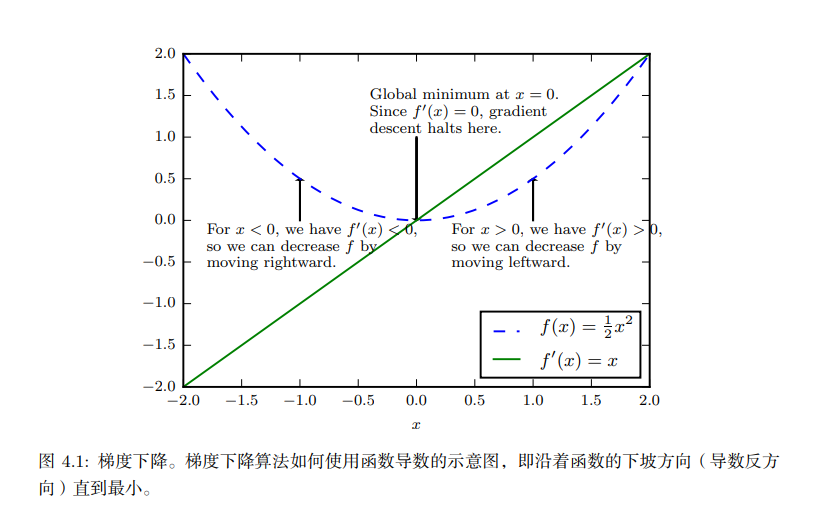
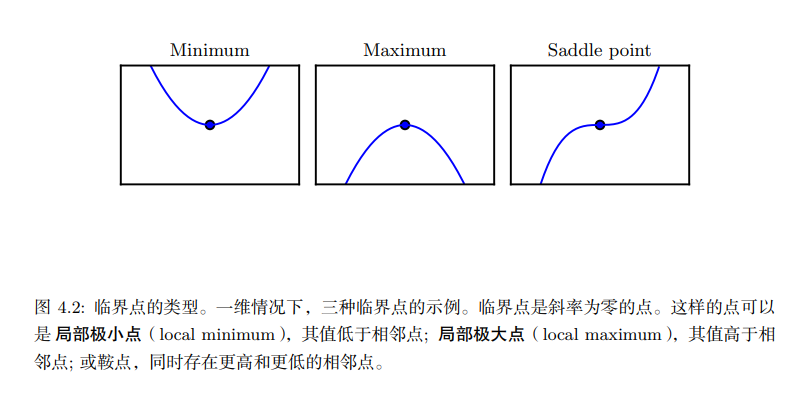
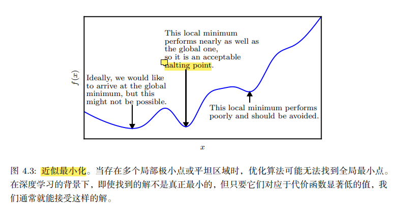
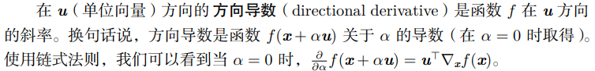
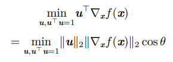
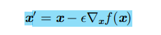

## 3.1 上溢和下溢

下溢：接近0的数被四舍五入为0

上溢：大量级的数被近似为无穷

上溢和下溢都会让运算变为非数字

例子：softmax函数

## 3.2 病态条件

定义：条件数表征函数相对于输入的微小变化而变化的快慢程度

可以理解为对误差的敏感程度

## 3.3 基于梯度的优化方法

目标函数：需要对其进行最小化或者最大化

损失函数(loss
function)：需要最小化的目标函数

梯度下降：

偏导数：![](data:image/png;base64,iVBORw0KGgoAAAANSUhEUgAAAg8AAAAkCAIAAACBs04pAAAAAXNSR0IArs4c6QAAAARnQU1BAACxjwv8YQUAAAAJcEhZcwAAEnQAABJ0Ad5mH3gAABMoSURBVHhe7Z0LcFVFmoBPpip74zjJWGgitRbR8mYSMUREvCjeLHojymsqZmYctGQQlKRmcCPcOCMqYwohRgfibuJjcZwbXkPYAnWVJUCUx70Dm/AK4AYNSCQjE8wUCUKtySohd6uy/Xf3OafPOX1eNzcBk/6qNLfPq7v//+///7vPg4S+vj5JIBAIBAJLfkD/CgQCgUBgjogWAoFAILBHRAuBQCAQ2COihSnRM1sXjklJSEhKu++V/RfoRoFAIBieiGhhwumah4s+nx0+33fx6LIfLPt1zXG6XSAQCIYl4pkoe1qrczO2PX32w0eupxsEAoFg2CHmFib0HN/wxB1pSQkJKWPmrWyRkq++iu4QCASC4YiIFlxa10y/44Xvfrv7XG9f59r7vzvnGZmSQncJBALBcMR9tGitzk1IKInQEgG25Va30lKciZQY6jPZGC+i+9c8t2/myrdn5SQnSkkpqT+Wpo3PovuuKCIlstQHVB48eGbgFpNGD3xfoIaBsFfDOEAV6eoxbgHgxAHo8oCOS4fELOs4NN6VkeKD1QoHyka+z7iOFq2RtQ1SMD9AixSvz99QNMdMtiB4e7Ra5Y0qdVtra6OxEXGjrfkv56bN8I2A39FjW1Y2FTyaG8d7FtHOwxsWTLl9xUFaNuXrbb/OuG/xhydMHshqrS6tIr8iJXnoV1UelSQWEjZ+GVa2mh0mDKyzpoAS/dnptOQUJ81HWAx0LLdgWaGXlgeQQHFIKsqQxQlNz2sMlQ2U3cYVx1baVHXXHU+8UX8mSstaQMmSz+te1uBo/HMDkr26zVXtLSwLomHhyJqJYxsUq/j+0ueScFCSgmH8xxJ/6BQ9QznHAsMRpxAhP95G9kEJ/pyCy0KBrSDOnN1YIGUta7zYd7E98tK45EDoZC/d45DejsbQ3HGpHhCE59k9dCvm/NGKQOqU1xs7nF2yt2PvS+NSp6w2tkAWDxaQIgx7UdsKz8ElEFgfJtifjTGryLoBDnSvPcSqpSY47IABpmLbWjV1wNHGSkEQeuhRxl28NmsFoSd+VnqxuWam1/ts+DwtM0BD9U3gykbXft55Olg7sRW3EW2FWKDsJmMDUB08IQ8j3M4tIluq/KFikhyZii4G1enxIgrr+yqVNAxKqIg20zSgAeVsLHFMh6//+fKNEzflXZVwze3PnH5qz/uFmYl0jyO69v7+Tt+ya5Z/1t3bVJEz9uaRdDuifdO8iX+evqt2wZ1pzi6ZmPZPS3ZtGr1k8qKIZoYRKcko8oWReFC+mlclp0Qwx1DUY4VeeCwwTXGIiQWoWrMCmVIMUwv3YMtRcOCFnHbAFqYe1rNR14Sh0+6MogZ1aohQ02W9A2PgXc858bTSpFtn1Wx//vBDD1e36GYYplMLjQ6M7QfjcJPoa5WM0ARKTUFGo2RsjJYjB0ZcQ9WWwZh0X7G4ixYwh0ezw1gma+xYMKL3UOzalWaRBYICBAt1pMiWEKcRjknMfGTNZ119fT2dR9cUjsMrUs45vra44szslUsfSEtMvO13xw7+JpPukLrqlsxp+N07C29zFXykEYGl7zz49pw3D8kjESJEY+gU9BgHTkU8ICoSCGxip2HoMMTiemIA+xFt1IpjwDeBhNN18V9uIAYLTl8j/7Zq3f0IWIxiNwQqscxZdxZzrsUOGoLaHoNw422liZmFb738dfFzH7TjorxeCC1gx77FAiEDXiuMLZNQb+VxQK3i7rVdm8Q5GYTneHqZ7x+uogV2TWqiYBoAsInoYHMkI9RDgY1hddJBpAwd9ezKQOQtdPnGVlnpbc1smwjEVp1ZZnyJdh/eUv2pVDDDZ3yGqr32zVUp/5w/0V2sAFImz5rf+eqfdnXhEhKAL1wPph0pmSOVIQlh8YColB82uJ9b6F2R3g1QHMscbImNWfoYtaUk/sGD3N6x6nvMJkMMVnX61KukF9afyi6Vr4rMMmPtXBzldYAR9xtl0Cio7dGm0gNjpbfOWHDn5vL/wO+x0lwftKpoGQqO7mDgEa5gDILmhoE13NxmqkSvTyrKMChZW58BUFsRGOvwDhUIN9FCL1TTAODAXekAQ0e60Hl+ZCcZRZIfXQzcErER9dauymCsZzjh9Jq8f0jxvfCpJG1+dCSy6p9t6qB7gI769+ukX94zjhZlomd2Lr4Pv9gx8d+Owewh2rJmaorOcSWOv3/mpVVbD+LZBRIWtls0NBp9WFjYa4P/Vn6At2VhrmaYtHPgjwvriO9K7brEA8OqsaqqCjoTs/c2QtJDiz5wmn9h/ysTUxKSMhbvxXE62rJpVkZS2ov7+Td0+SBx48hOfvbJvy8fsVkp7npCytQaohAimekbyEyC4p1QkPXphr0ttIhkDs8xuF2LIDFdi6o1i5kvchcw5a6vNK3QG6isDwdRusDGG159KiRUoAZcfsVdfpxHC56bNoE3KtTJgDl4sZI+6QQZRV4VspL6Mh9Yy6lQYx4KGMjLSKFwyN/Q3IYPwwZpSFiIQxx0/d70RLjvy9UB5Zah9u3vk0fqJP+4m3U52xfrF24PvLvr5Ryp+0Dxax93XYgsmvzkx92S555MtvUp6bdlSbubTtAiAow8WFYZAA+LBxN4O+WHlI8TTRhbeBuSBZlwuSNmb81UBtdQ8kN6QbKAxtgEqJ5VIzQa9QPmAfGYYuAxj/MOF3y9bUXtxG2na2d+9WplXYd0IfL7pd1LTvR0vuw072ZmMeCQ1JkY1z2x3TdYNA/O9ZCcbVUWi5U2v/Mv3Us+O1Rx08fP1BxCoaP66Q8nbuvq2z7rBnoA4aZbJkiH9rWQKTDVstIVHDps8zowaz+McFp2CoQK5C7sxzzKtcLBqjxZTHhxPRjkV4cUSGYVJunTcMNptGitnlPkC+sCu6X/Yaw2UIkDOt1hDqibZs04S2BzXBQAUMAojQRQphZAE0p6vwkvaFwhUwsg+sXhCP/tjOilby9Jqck/okWZnzz5QeUDabdN+kUqKrz77jPBh2ofhWdLelZMIgdQrr7mOulk+3laQpJHHsJdx0kIZSIIRV+GYCOvHsQccL2FEXiayyOlFsyflC7lzn/bP2pmaH/7LnxBrDW/GvL5ngQajBqHnGL/AgYJFSjphLxDdbF68JSM5boZf3glMGKEb8Y0qe5I486ymvErnD/vIEvblP77H1Vp8rhsTc9GA830SXYF11aaXfxOYWYSWOm5Pcciq0rbF5YHOLfzUq6+VpL+evYcLcJSgfKcuzZ0mIEMAVy+6wGNsg3tUhHIX7FeTQH80amQtDaCpARuTQqtK86me4ygq8Y8CIYcTqNFW7PEf2IA+xVkrfivnN7i7JbFuKTKh6obDgcd4XBUmk1DO9I5VVwgP0gTU95dC5dQZ+Eeer6GE027pSz/aM7bGW1/a0LJV5rJexu3jJ+K/n9p/Y5r//PQCt5AZIHHMzSJMnaB2pUoa1ifqU17HZ3uBPw0V10wafOvJs9fPH/OybL/3lR49z8mwS5Y0gyWrZvrlx8xwdGDu2KBLAEZU1Wp1gHapB6aHhCHoAx5Ni5qMRgt5frR/qxLbzxWffeyR7SZtA2WuZQ2/jlLu+3xegtxYmYXL/pjpfuKizp+u3iCg6iJnzNSeqUJHaagMR5TGEV2Ul/YZrjDYYQksdSVILtDscIYDEB1MCxEqNDiNFoEKg1i82fHSY6wTKEbPXSg4WHPugb5sPRsfwMkB+zaVaxQZ+Eeej7L6SPbT0r3jx1NiyzpN45F+zvZNWKGq0b+5Eb4+4t8u1ABoxDNu9bNpSUAu0BlTmDm9hhYn8mbW/Axz8sxxjAzIrBiVyjQuerVTx8rylX6hXwjPKzoDcjhwjxYALrEEMDdNEfTA87pLskcM0m6VDB7mqtYQeA2VJ4JqGhyHij0AzyRx4mzKTFbacrNvrGXbvrNz5zECjxI0eB9iwzZeIxUO2hOiuVryAqIUWgffFLzTwXseuKUMA053NzlZoBkyAnKerUVuuQWRX8Y4Vi7jM6hrGQq4GlQCpULD74NsAm6Ac/wJ+TcyBtMiZ6rPdK57v+lRQ0XIoseLT8Lv0xv73z7P19LWTegib4+coOslHQMuxzNFj6xzS0MI1ALL8x0tzdfHHf3qEMLpqovjMhjFN60hVkDBAvnz9ZD70j/kXGxSQaMc1JWD4kD0Zaa9eFR0kdHPqcbFKKREre3vPnEa2pBwXm2Re9jtVJkpmv//ULqyYYTJsFE6vr2vCTdPBIWVRGgBny7Mbc6gh9RjX2kqvYJ1moDLDT50RmMcSBTwYuR1uMCLAhZPwnxxphO3JntfaEhTIzRgiRDYN8480cqxH/B0YBiFYdDo701uuSWugJ4AIsZQlBm8k/8Tn9DA9Ksg3fRBg2Y4XvuvVV5dF1D1vhpUsMnfzU4lwufvPbwQ03Pb66YgAq8A4COEw38dFCNx7LwMRY2rdeJfm4BGL0NnGUTggxOOtpS/djy7HV79x7eEZSqphnf3SIfxoBx7FqLqN/I6vRvS0H/tdNUParf0cONktGWdUs7F763IOvczmN6iSYGKrm3vOElC9oK7pKZ3uFZT63iT0xWCrHiD++OX7dyqlR34LhJhPz8yEfShHsymcdywSbCvqI88MH9GKla+7Rdq8K1Bokx4AGC74LaJhBwGsL0OKc58pAltmjBJEM4ECOHo6yBgGI5WSZZXLIeyQyt6cXoojDYsN8zfX1GvVHKQiob9CwAu3TTDxBen/vwNOm9fZ/QInBoaVpCwrV3vCj96x/nTL1rOuRk7+053HPsjSnl2s/zRI8fqPPM++ldxnRQ9v1E5MrKB9/i1dDCoJ9bKLDyQ2fSIlxD3oPlrOhUTe6BnuMbfvXkmZc2F2YmJqY9sGLba7dEiibP//DLHrqfwa2rhIrgyRnUV8Zx4LGOjMY6YpjPjzhGi+Z8pf+35NkJY8ZP8zR8cKC95/ibC/70Bd5FRPn4Vvn5HwR+2xfZbKm0Tm6Yog8WCM8MnGDBZEmsZnRhRt2ljz+WuLZSAAX++VseKH8kc/Qk/6UNuw/3dH60aElYNwVpPbbzXM6sSdowJD9Licay49GvwUGewgNW5EBGWDZuXgu3QV4xJD4GMehu5jJCLdgZIH803GBcwTiQ/3KjBW+gkHGiG7B4lJoNYrwTozkCb/aHQnA9zqnkLO5QHUB6dzyFcrOKJlo08s32eZ7UYPgbWsTPMUrJd5fvI9/XObV+SjJqdnL23Jrmi3iLzPna2Z5RLx1kP9qjFTGVIfVDqkSowixxcAwc4g+GSW20Lvyb7JGbQbWCS7Qp9EC5BGhbhw7XdoVsNm0QrsNat7Qy4yUsL6yT6De1syWPd35tGxZ678Fyrwc0s1H5YBdoO7D6S1rCdWqvre+WgrYZUDLpvb69prv0B8rAdn0TXFtpX1NFlpQ85fWjxEq/en9msuRJvVe2WgX4gIinYONXtIgh2iJNg8aQ1lAdatG031R2DCbHMBeXL4lrpvDERM7R7cEnGRol16hUbtKKoUks0YL8HxUVSaEtiuhgj70I4QgV02PZw5SDyEaiSKNOY6a3rXZBNnLXvJHgCBhVnmDY6kNsX20s8ORUNDn7VpvM+XBw1Kig7pNtqohZcQCKeji/3QI14OuzGsIb2KuqOzW7rNFqjjTO5kzaA7YtJhCZ6I+E882r0PbEFlSFlc9V2sDHID7maKUR+vZat5+irdbYoQGy0t6ToYDu+5vQXG0DaG+hiYbtmo4ZjpDB15RhjlC3c0+TYYXDHIg36yWrFSRBOUdpoGlLhyIxRIug8slTjqQUEfdXgvKFlOvQyohZ6MeQ/SCy48v1+VMq4JubF5vfDnhyXm+m250DDfTM267mZFzi9Q1aRhwcUStq6Lce5IpoCYOvLksc24QqfdhnqwzSPONhRLk8UAvwSc67gw5XpkMUXVMB0hIZ24arnEUeVfvdVj1waW5zmWagn/1WkDugVXG3Us43aKGTZl0zSIajmEEFW4HLBiiWM8gKvJzE/vzoQALWw9OCmVbja21QS8HGs7TkEJgASLrVIhN6Oxprnn5w7PIDtGxK9+7nsh584YPjsUx0rmQG30fGHVio8odOduxYvVlejPo+MBBWemLVjAlzX/8vsmQnGMpcmdHiMoDSI/Kt/+Tse8elSrNrIfsi+QP2bDiAmUQkvMadeu8LO8SIGS7gGxke72P6O0xXMMJKBf0kAf0H06lhTuuavOwlqau2Vc/MSWwqu91Xnr9H/vRGpCShNDvka/ZWKg9mdG19/MerZpzVfmBHIBAIhjIiWiCi+1+8IdC2+u9//im8b9zyx7uyPn5GjQUoXORJw/3L9gKBYLgT49t5QwtX/w733kVJCQlpSw/RokAgEAwLRLRA/Cg5VTrRcqZH6vn7X16Zu+y6t5b/XPkmUKRkS344yLwzPKm89ilp6vhbaFEgEAiGBSJaIPj/Djd5WXNLfmUgPRs+OyO/INz2tybt1w0EAoFg6CPuW7ila+vjaXsL9f/8hEAgEAxtxNzCLZ8f+ejOzJFndtYd/Y5uEQgEgqGPiBZuuTZ9zOHi6c9f8Ob8kG4RCASCoY4k/T9zoeQvrd85RQAAAABJRU5ErkJggg==)

梯度：相对于一个向量求导的导数

为了最小化函数，就是找到它下降得最快的方向：

最速下降：

其中 ϵ 为 学习率（learning rate），是一个确定步长大小的正标量

## 3.4 约束优化

只在x的某些集合S中找到函数的最大值或者最小值

KKT条件
