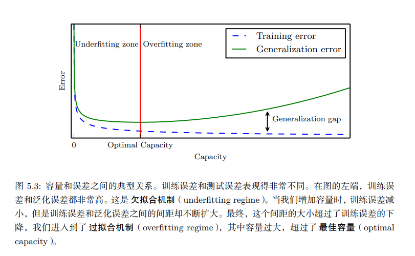

## 4.1 学习算法

4.1.1 任务 $T$

常见的机器学习任务：

- 分类
- 输入缺失分类
- 回归
- 转录
- 机器翻译
- 结构化输出
- 异常检测
- 合成和采样
- 缺失值填补
- 去噪
- 密度估计或概率质量函数估计

4.1.2 性能度量 $P$

用于评估机器学习算法的能力。

通过准确率和错误率来评估。

4.1.3 经验 $E$

监督学习（标签、目标）、无监督学习

4.1.4 线性回归

均方误差(mean squared error):

为了构建一个机器学习算法，我们需要设计一个算法，通过观察训练集来获取经验，减少均方误差，来改进权重。

## 4.2 容量、过拟合和欠拟合

机器学习的两个挑战：欠拟合（不能在训练集上获得足够低的误差）、过拟合（训练误差和测试误差之间的差距太大）

容量：拟合各种函数的能力

