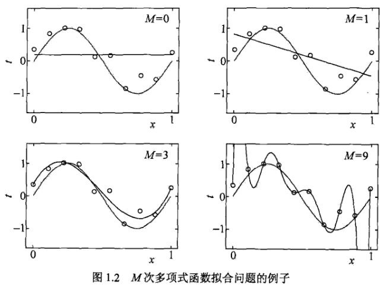

1.1 统计学习
组成：监督学习、半监督学习、强化学习
三要素：模型、策略、算法

## 1.2 监督学习

实现步骤：

1. 得到一个有限的训练数据集合
2. 确定模型的假设空间，也就是所有的备选模型
3. 确定模型选择的准则，即学习的策略
4. 实现求解最优模型的算法
5. 通过学习方法选择最优模型
6. 利用学习的最优模型对新数据进行预测或分析

训练集：

实例x的特征向量：

模型：

1）决策函数        $Y = f(x)$ 

     预测形式     $y=f(x)$    

2）条件概率分布  $P(Y|X)$

     预测形式     $arg maxP(y|x)$        

## 1.3 统计学习三要素

模型（假设空间）：

决策函数

条件概率分布

策略

经验风险最小化：

结构风险最小化：

## 1.4 模型评估与选择

训练误差：

测试误差：

多项式拟合问题：

## 1.5 正则化与交叉验证

正则项的作用：约束参数数量、大小，减少模型的复杂度，防止过拟合

最小化结构风险：

交叉验证：

数据集随机划分为以下3部分：

训练集：模型的训练

测试集：模型的选择

验证集：模型的评估

## 1.6 泛化能力

期望风险（泛化误差）与经验风险（训练误差）：

即为平均损失函数误差和在训练集上的误差 

Hoeffding不等式

通过该不等式可以推导上述的结论。

局限性：有限个函数

## 1.7 生成模型与判别模型

生成方式：

判别方式：$f(x)或P(Y|X)$

## 1.8 分类问题

精确率：预测为正类的样本中有多少被分对了

召回率：在实际正类中，有多少正类被模型发现了

## 

## 1.9 标注问题

## 1.10 回归问题

## 1.11 极大似然估计

## 1.12 梯度下降法

如果有个函数图像，我们可以通过观察的方式得到函数的最小值，那如何通过算法的方式得到函数的最小值呢？

每一步计算当前的梯度，由此来决定该往什么方向走
