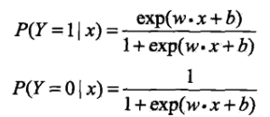
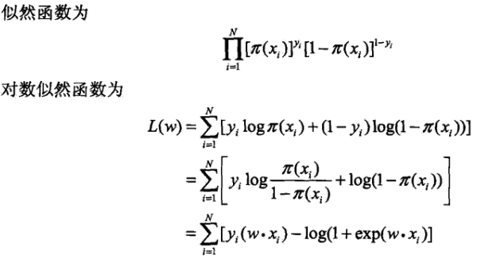
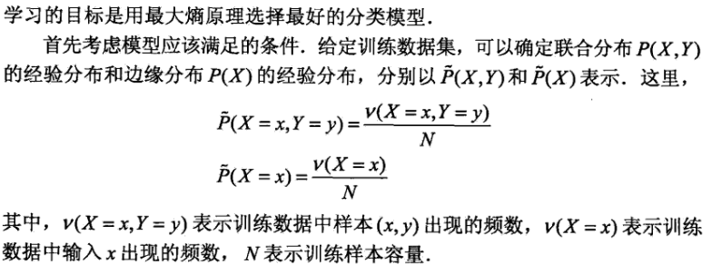
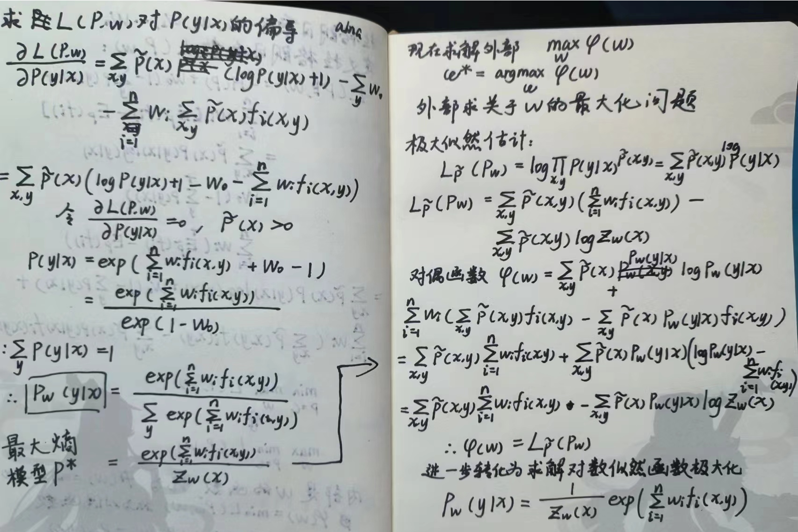
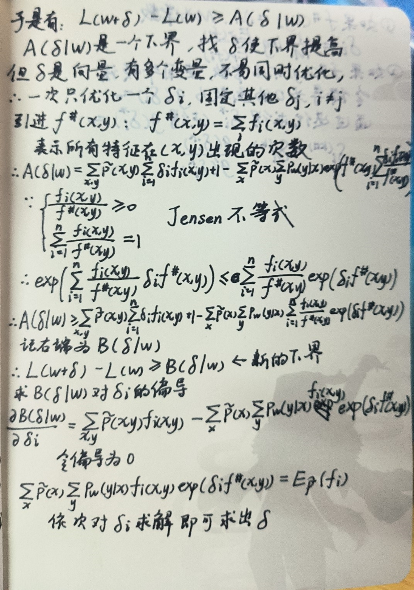

<!--  -->

## 6.1 逻辑斯谛回归模型

感知的缺陷：

1. 跳跃间断点不可微分
2. 由于sign不是连续可微，因此在梯度下降的时候脱去了sign

逻辑斯谛回归模型：

参数估计：

对对数似然函数进行求导，求出对数似然函数的极大值，从而估计w的值。

## 6.2 最大熵模型

凡是知道的，考虑进去，凡是不知道的，通通均匀分布。

熵：

特征函数：

最大熵模型的学习可以形式化为约束最优化问题

求解时利用拉格朗日乘子法，最后得到：

推导过程：

6.3 IIS

算法：

公式推导：

