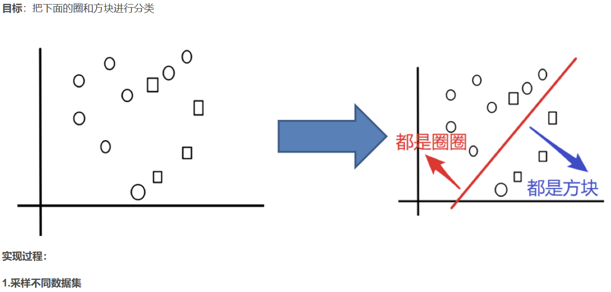
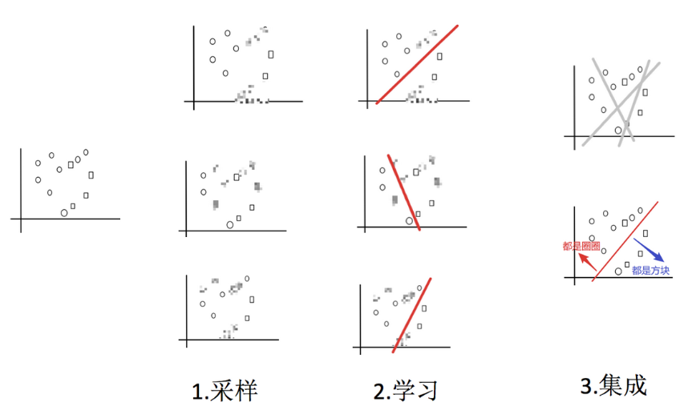
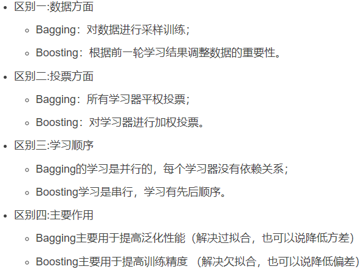

---

title: 08-集成学习
published: 2024-03-19
description: ''
image: ''
tags: []
category: '统计学习方法'
draft: false 
lang: ''

---

<!--  -->

## 1.1 什么是集成学习

集成学习通过建立几个模型来解决单一预测问题。它的工作原理是生成多个分类器/模型，各自独立地学习和作出预测。这些预测最后结合成组合预测，因此优于任何一个单分类的做出预测。

## 1.2 集成学习中boosting和Bagging

## 2.1 Bagging集成原理

## 2.2 随机森林构造过程

## 3.1 包外估计(Out-of-Bag Estimate)

在随机森林的构造中，如果进行有放回的抽样，总会有一部分样本是选不到的，称之为包外数据，当数据足够多，对于任意一组数据是包外数据的概率是：

由于基分类器是构建在训练样本的⾃助抽样集上的，只有约 63.2％ 原样本集出现在中，⽽剩余的 36.8％ 的数据作为包
外数据，可以⽤于基分类器的验证集。

经验证，包外估计是对集成分类器泛化误差的无偏估计. 在随机森林算法中数据集属性的重要性、分类器集强度和分类器间相关性计算都依赖于袋外数据。

## 3.2 包外估计的用途

- 当基学习器是决策树时，可使⽤包外样本来辅助剪枝
   ，或用于估计决策树中各结点的后验概率以辅助对零训练样本结点的处理；
- 当基学习器是神经网络时，可使用包外样本来辅助早期停止以减小过拟合 。

## 4.1 Boosting

随着学习的积累从弱到强

简而言之：每新加入一个弱学习器，整体能力就会得到提升

每轮训练，调整数据分布，将训练注意力集中在错误数据，即对正确的数据进行缩小，错误的进行放大。

## 4.2 bagging与boosting的区别

## 5.1 AdaBoost构造过程

## 6.1 GBDT

梯度提升决策树(Gradient Boosting Decision Tree)

GBDT = 梯度提升 +
Boosting + 决策树

6.1.1 回归树生成算法

6.1.2 提升树算法

当损失函数是平方损失和指数损失函数时，梯度提升树每一步优化时很简单的，但对于一般损失函数而言，往往每一步优化起来不那么容易，因此使用GBDT，利用最速下降的近似方法，关键是利用损失函数的负梯度作为提升树算法中的残差近似值

## 7.1 XGBoost

