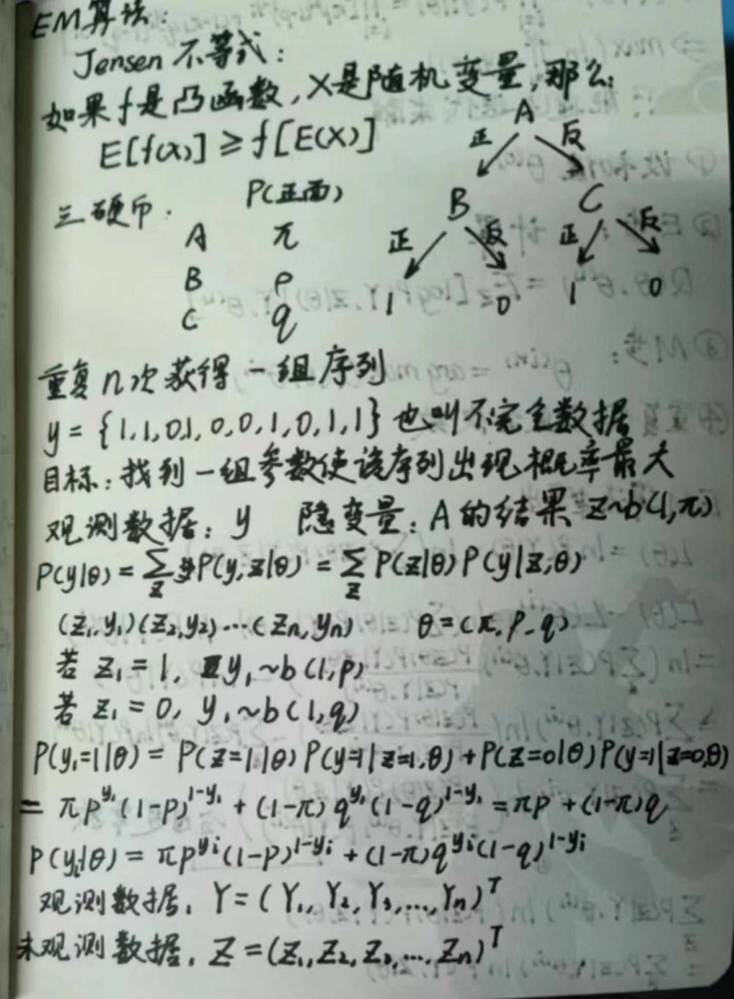

---

title: 09-EM算法
published: 2024-03-22
description: ''
image: ''
tags: []
category: '统计学习方法'
draft: false 
lang: ''

---

<!--  -->

EM算法也称期望最大化（Expectation-Maximum,简称EM）算法。

它是一个基础算法，是很多机器学习领域算法的基础，比如隐式马尔科夫算法（HMM）等等。

EM算法是一种迭代优化策略，由于它的计算方法中每一次迭代都分两步，

其中一个为期望步（E步）

另一个为极大步（M步）

所以算法被称为EM算法（Expectation-Maximization Algorithm）。

EM算法受到缺失思想影响，最初是为了解决数据缺失情况下的参数估计问题，其算法基础和收敛有效性等问题在Dempster、Laird和Rubin三人于1977年所做的文章《Maximum likelihood from incomplete data via the EM algorithm》中给出了详细的阐述。其基本思想是：

首先根据己经给出的观测数据，估计出模型参数的值；

然后再依据上一步估计出的参数值估计缺失数据的值，再根据估计出的缺失数据加上之前己经观测到的数据重新再对参数值进行估计；

然后反复迭代，直至最后收敛，迭代结束。

EM算法计算流程：

1 极大似然估计

1.1 问题描述

假如我们需要调查学校的男生和女生的身高分布
，我们抽取100个男生和100个女生，将他们按照性别划分为两组。

然后，统计抽样得到100个男生的身高数据和100个女生的身高数据。

如果我们知道他们的身高服从正态分布，但是这个分布的均值 μ 和方差 δ 是不知道，这两个参数就是我们需要估计的。

问题：我们知道样本所服从的概率分布模型和一些样本，我们需要求解该模型的参数.

我们已知的条件有两个：

- 样本服从的分布模型
- 随机抽取的样本。

我们需要求解模型的参数。

根据已知条件，通过极大似然估计，求出未知参数。

总的来说：极大似然估计就是用来估计模型参数的统计学方法。

1.2 用数学知识解决现实问题

1.3 最大似然函数估计值的求解步骤

2
EM算法实例描述

我们目前有100个男生和100个女生的身高，但是我们不知道这200个数据中哪个是男生的身高，哪个是女生的身高，
即抽取得到的每个样本都不知道是从哪个分布中抽取的。

这个时候，对于每个样本，就有两个未知量需要估计：

（1）这个身高数据是来自于男生数据集合还是来自于女生？

（2）男生、女生身高数据集的正态分布的参数分别是多少？

具体问题如下图：

对于具体的身高问题使用EM算法求解步骤如下：

（1）初始化参数：
先初始化男生身高的正态分布的参数：如均值=1.65，方差=0.15；

（2）计算分布：
计算每一个人更可能属于男生分布或者女生分布；

（3）重新估计参数：
通过分为男生的n个人来重新估计男生身高分布的参数（最大似然估计），女生分布也按照相同的方式估计出来，更新分布。

（4）这时候两个分布的概率也变了，然后重复步骤（1）至（3），直到参数不发生变化为止。

3 EM算法流程

