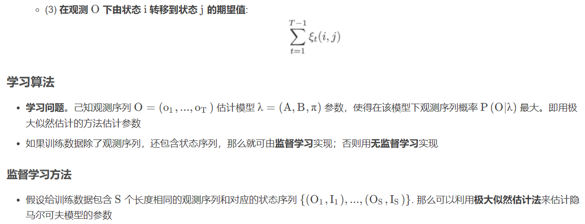

---

title: 10-隐马尔可夫模型
published: 2024-03-25
description: ''
image: ''
tags: []
category: '统计学习方法'
draft: false 
lang: ''

---

<!--  -->

隐马尔可夫模型的基本概念

隐马尔可夫模型的定义

- 隐马尔可夫模型是关于时序的概率模型。它描述由一个隐藏的马尔可夫链随机生成不可观测的状态随机序列 (state sequence)，
   再由各个状态生成一个观测从而产生观测随机序列 (observation sequence) 的过程。序列的每一个位置可以看作是一个时刻
- 隐马尔可夫模型属于生成模型，表示状态序列和观测序列的联合分布，但是状态序列是隐藏的，不可观测的

隐马尔可夫模型的两个基本假设

(1) 齐次马尔可夫性假设，即假设隐藏的马尔可夫链在任意时刻 t 的状态只依赖于其前一时刻的状态，与其他时刻的状态及观测无关，也与时刻 t 无关:

(2) 观测独立性假设，即假设任意时刻的观测只依赖于该时刻的马尔可夫链的状态，与其他观测及状态无关:

观测序列的生成过程

隐马尔可夫模型的 3 个基本问题

标注问题

隐马尔可夫模型可以用于标注。标注问题是给定观测的序列预测其对应的标记序列。可以假设标注问题的数据是由隐马尔可夫模型生成的。这样我们可以利用隐马尔可夫模型的学习与预测算法进行标注，即输入为观测序列，输出为标记序列 (状态序列)

前向算法 (forward algorithm)

后向算法 (backward algorithm)

