---

title: 11-条件随机场
published: 2024-03-29
description: ''
image: ''
tags: []
category: '统计学习方法'
draft: false 
lang: ''

---

<!-- 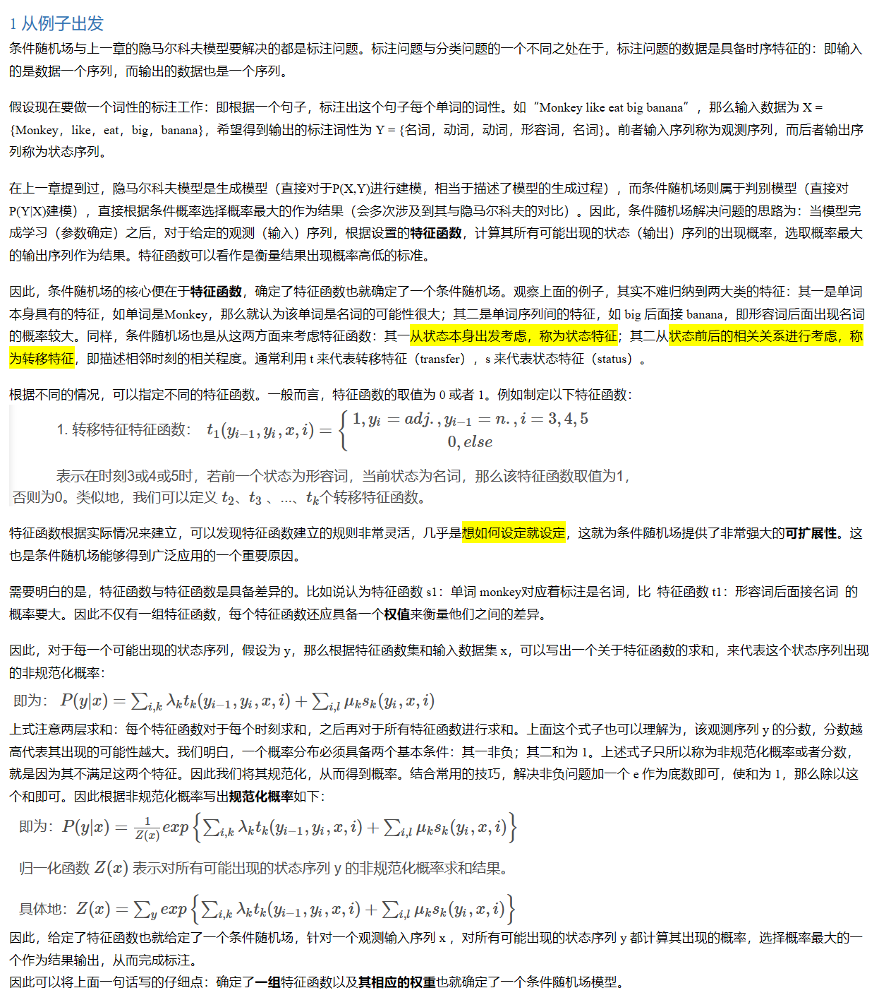 -->

## 1 从例子出发

条件随机场与上一章的隐马尔科夫模型要解决的都是标注问题。标注问题与分类问题的一个不同之处在于，标注问题的数据是具备时序特征的：即输入的是数据一个序列，而输出的数据也是一个序列。

假设现在要做一个词性的标注工作：即根据一个句子，标注出这个句子每个单词的词性。如“Monkey like eat big banana”，那么输入数据为 X = {Monkey，like，eat，big，banana}，希望得到输出的标注词性为 Y = {名词，动词，动词，形容词，名词}。前者输入序列称为观测序列，而后者输出序列称为状态序列。

在上一章提到过，隐马尔科夫模型是生成模型（直接对于P(X,Y)进行建模，相当于描述了模型的生成过程），而条件随机场则属于判别模型（直接对P(Y|X)建模），直接根据条件概率选择概率最大的作为结果（会多次涉及到其与隐马尔科夫的对比）。因此，条件随机场解决问题的思路为：当模型完成学习（参数确定）之后，对于给定的观测（输入）序列，根据设置的特征函数，计算其所有可能出现的状态（输出）序列的出现概率，选取概率最大的输出序列作为结果。特征函数可以看作是衡量结果出现概率高低的标准。

因此，条件随机场的核心便在于特征函数，确定了特征函数也就确定了一个条件随机场。观察上面的例子，其实不难归纳到两大类的特征：其一是单词本身具有的特征，如单词是Monkey，那么就认为该单词是名词的可能性很大；其二是单词序列间的特征，如 big 后面接 banana，即形容词后面出现名词的概率较大。同样，条件随机场也是从这两方面来考虑特征函数：其一从状态本身出发考虑，称为状态特征；其二从状态前后的相关关系进行考虑，称为转移特征，即描述相邻时刻的相关程度。通常利用 t 来代表转移特征（transfer），s 来代表状态特征（status）。

根据不同的情况，可以指定不同的特征函数。一般而言，特征函数的取值为 0 或者 1。例如制定以下特征函数：

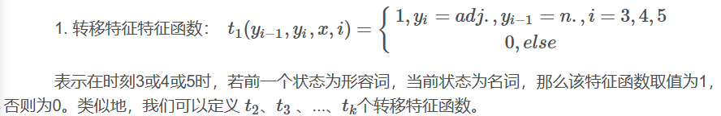

特征函数根据实际情况来建立，可以发现特征函数建立的规则非常灵活，几乎是想如何设定就设定，这就为条件随机场提供了非常强大的可扩展性。这也是条件随机场能够得到广泛应用的一个重要原因。

需要明白的是，特征函数与特征函数是具备差异的。比如说认为特征函数 s1：单词 monkey对应着标注是名词，比  特征函数 t1：形容词后面接名词  的概率要大。因此不仅有一组特征函数，每个特征函数还应具备一个权值来衡量他们之间的差异。

因此，对于每一个可能出现的状态序列，假设为 y，那么根据特征函数集和输入数据集 x，可以写出一个关于特征函数的求和，来代表这个状态序列出现的非规范化概率：

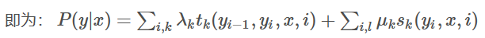

上式注意两层求和：每个特征函数对于每个时刻求和，之后再对于所有特征函数进行求和。上面这个式子也可以理解为，该观测序列 y 的分数，分数越高代表其出现的可能性越大。我们明白，一个概率分布必须具备两个基本条件：其一非负；其二和为 1。上述式子只所以称为非规范化概率或者分数，就是因为其不满足这两个特征。因此我们将其规范化，从而得到概率。结合常用的技巧，解决非负问题加一个 e 作为底数即可，使和为 1，那么除以这个和即可。因此根据非规范化概率写出规范化概率如下：

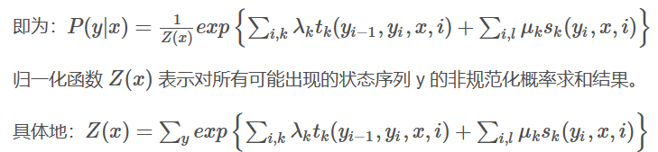

因此，给定了特征函数也就给定了一个条件随机场，针对一个观测输入序列 x ，对所有可能出现的状态序列 y 都计算其出现的概率，选择概率最大的一个作为结果输出，从而完成标注。

因此可以将上面一句话写的仔细点：确定了一组特征函数以及其相应的权重也就确定了一个条件随机场模型。

## 2 条件随机场原理

先参考书中，给出条件随机场的定义：条件随机场是给定一组输入随机变量条件下，另一组输出随机变量的条件概率分布模型，其特点是假设输出随机变量构成马尔科夫随机场。

看完定义可以有以下直观理解：其一，跟隐马尔科夫模型类似，数据为序列数据；其二，与隐马尔科夫不同，求解的条件概率分布模型，也就是说是一个判别模型算法。看完定义感觉不明白的便是马尔科夫随机场了，这也是条件随机场的核心之处。

### 2.1 概率无向图模型（马尔可夫随机场）

#### 2.1.1 理解模型

概率无向图模型，又称为马尔科夫随机场，是一个可以由无向图表示的联合概率分布。

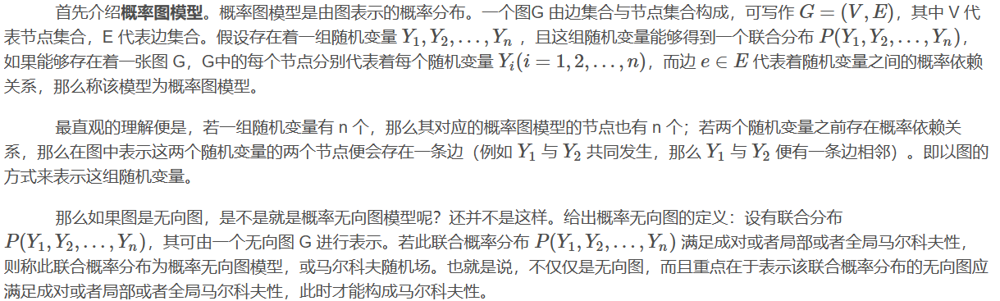

成对、局部、全局的马尔科夫性定义是等价的。

设有节点集合A，B是在无向图 G 中被节点集合 C 分开的任意节点集合，如下图所示。

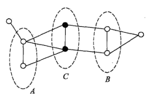

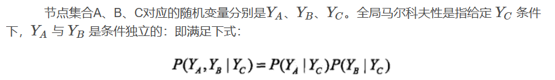

结合表示图与定义，不难得到马尔科夫性描述的是节点之间的这么一种关系：即节点只与其相邻的节点有关系，与不相邻的节点没关系；换句话说，一个随机变量只与其有概率依赖的随机变量有关，与其没有概率依赖的随机变量无关。

其实在上面这句话中忽略了一个重要因素，那就是条件独立。也就是说，有关系与没关系的依据是在某一条件下进行判断。姑且先这样理解。

#### 2.1.2 模型的因子分解

根据这一节内容最开始对于条件随机场的定义，我们知道输出的随机变量的联合概率分布应该是一个马尔科夫随机场。那么该如何求解其联合概率分布呢？马尔科夫场的一个最大特点便是易于分解，也就是可将该联合概率分解其若干个联合概率的乘积，化整为零，这样便利于我们进行计算。在叙述模型的分解时，先介绍团与最大团的概念。

若在无向图 G 中，若存在着一个节点子集 A，对于 A 中任意两个节点在 G 中均有边连接，那么这个节点子集 A 称为一个团（clique）。能够取得的最多节点个数的团则称为最大团。如下图所示：

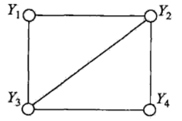

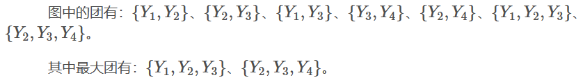

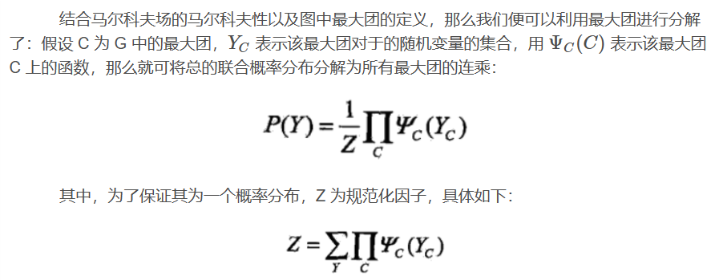

### 2.2 条件随机场的定义

先进行一般条件随机场的定义：设 X 与 Y 是随机变量，通常而言，X 对应着输入序列即观测序列，而 Y 对应着输出序列即状态序列。若随机变量 Y 构成一个由无向图 G 表示的马尔科夫随机场，即：

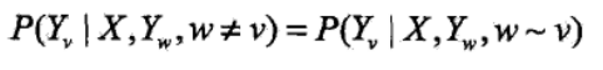

上式对于任意节点 v 都成立，则称条件概率分布 P(Y|X) 为条件随机场。其中，w≠v 表示非当前节点 v 的节点集；w∼v 表示图中与 v 有边相连接的节点集。

对于上式的一个直观理解即为：在给定输入数据 X 以及随机变量 Y 构成一个马尔科夫随机场的条件下，某个随机变量 Yi发生的条件概率只和与其有概率依赖的随机变量有关，与其余随机变量无关。这样的话，在建模的时候，对于某个随机变量而言，就只考虑和其有关系的变量了。

其实这和隐马尔科夫模型有相似之处。在隐马尔科夫模型中，假设当前状态只与上一个状态有关，而一般形式的条件随机场相当于将其进行了扩展：当前状态可能不仅与上一个状态有关，可能会与多个有关状态有关系。

可能也发现了，当随机变量 Yi，也就是状态之间的关系很复杂时，那么一般形式的条件随机场其实也是很复杂的。因此，在实际中，使用线性链条件随机场的情况也很常见。顾名思义，线性链条件随机场即假设马尔科夫随机场符合线性链的结构。一个线性链的例子如下图所示：

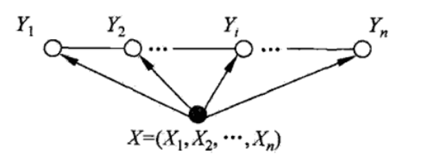

观察上图可发现，原本的概率无向图现在简化为了一条线性的链，其中每个随机变量 Yi只与它前后相邻的随机变量有关。而输入的序列 X 与每个 Yi都有关系。

在定义中，并没有要求 X 和 Y 具备相同的结构。但是为了简化模型，常常认为 X 和 Y 具备相同的结构，如下所示：

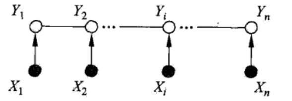

看这个图好像有点熟悉，咋一看不是和隐马尔科夫模型一样吗？每个观测对应一个状态，当前状态由上一个状态决定且当前状态决定下一个状态，即当前状态与前后两个两个状态都有关系。其实不然，注意上图，这里的 Y 表示状态，而 X 表示的是观测序列，箭头由 X 指向 Y，可以理解在 X 的条件下 Y 的概率，即条件概率 P(Y|X) ，这是典型的判别模型思路；而隐马尔科夫模型是一个生成模型，生成模型并不直接针对 P(Y|X) 建模，记得在隐马尔科夫模型中，模型的三个核心要素其中之一便是由隐藏的状态 Y 推出观测 X 的观测概率分布矩阵，即条件概率 P(X|Y)。因此若画出隐马尔科夫模型的建模过程，那么箭头的方向应该由 Y 指向 X。

结合以上，给出线性链条件随机场的定义：若在给定观测随机变量序列 X，状态随机变量序列 Y满足下列马尔科夫性：

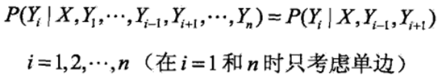

那么称条件概率分布 P(Y|X)为线性链条件随机场。

### 2.3 条件随机场的表示

#### 2.3.1 参数化形式

设 P(Y|X) 为线性链条件随机场，当 X 取值为 x，Y取值为 y 时，条件概率 P(Y=y|X=x)有如下形式：

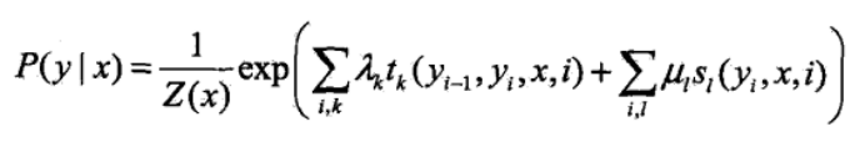

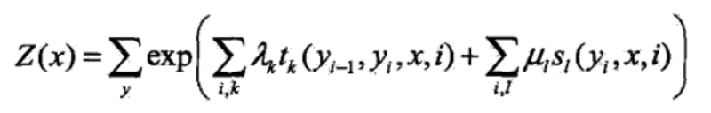

与第一节例子中定义的类似。tk(yi−1,yi,x,i)表示自己定义的某个转移特征，该转移特征与上一个状态，当前状态，输入序列，当前时刻四个参数有关，且具备权重λk，共定义了 k 个转移特征；sl(yi,x,i)表示自己定义的某个状态特征，该状态特征与当前状态。输入序列、当前时刻三个参数有关，且具备权重μl，共定义了 l 个状态特征。将这些特征进行求和可以得到类似于评价概率高低的一个“分数”，这个“分数”称为非规划化概率。将分数通过取 e 为底数，并除以归一化参数 Z(x)，使其变为真正概率，此时称为规范化概率。常常为了简化计算，有时候计算到非规范化概率就可以了。

#### 2.3.2 简化形式

为了方便一些理论的推导和证明，也可以用简化形式来表达条件随机场。

注意在上述公式中，有两个求和的计算，一是某个特征函数先对于所有状态进行求和，二是对于所有特征函数都进行求和。因此得到的一个简化思路便是：第一，重定义特征函数，使得这个特征函数对于各个时刻的状态都有定义，从局部状态转为全局状态，这样就省略了内层的那个求和；第二，将转移特征函数和状态特征函数及其权值用一个统计的符号进行描述。

下面进行简化。设有 K1个转移特征，K2个状态特征，总特征个数 K=K1+K2，引入以下记法：

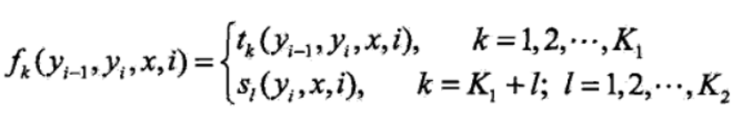

然后将特征函数对于每个时刻的状态求和，记：

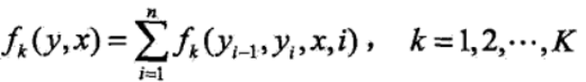

注意虽然上面两个记法都用的是 fk()，但是里面参数不一样代表的是不同函数。为了与书中符号保持一致，就不改写了，姑且理解为“多态”吧。

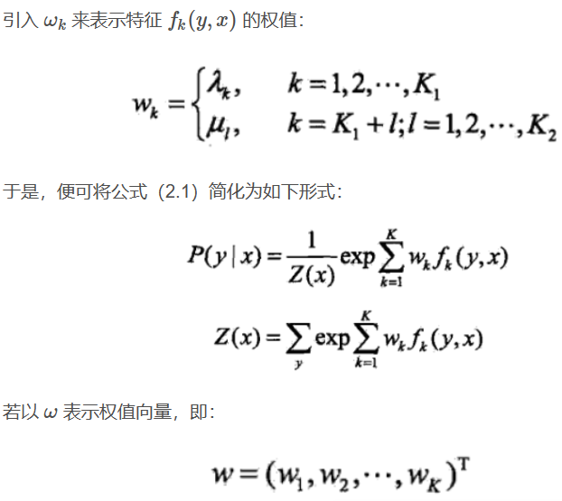

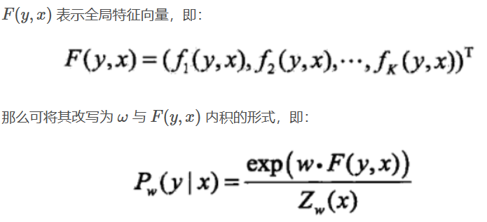

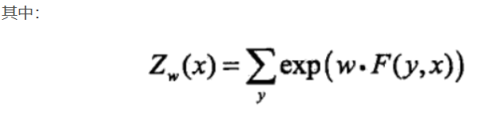

#### 2.3.3 矩阵形式

假设给出的条件随机场如上一节内积表示形式，可将条件随机场 Pw(Y|X)利用矩阵的形式进行表示。利用矩阵来表示条件随机场，需要引入标记：起点标记 y0=start；终点标记 yn+1=stop。那么此时我们考虑的时刻便是 i=0,1,2,...,n,n+1，共计 n+2个时刻。回头看转移特征的定义：转移特征考虑的是前一个状态和当前状态。因此对于时刻 i=1开始，每一个时刻都按照如下所示定义一个 m*m 的矩阵（m为状态的取值个数），共计定义 n+1个矩阵。

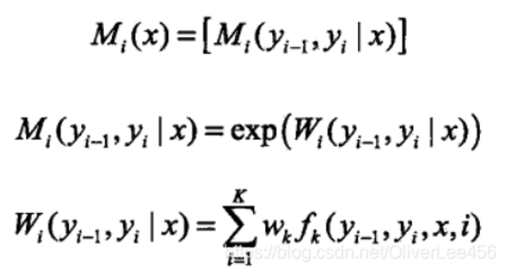

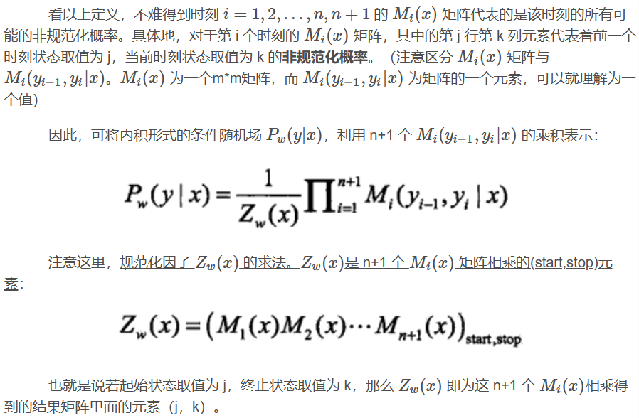

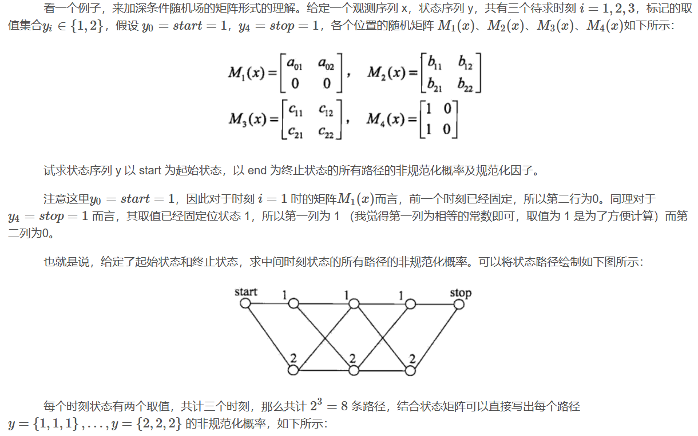

## 3 条件随机场的三个基本问题

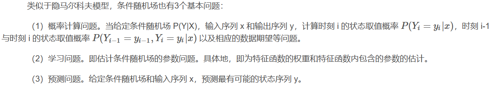

### 3.1 概率计算问题

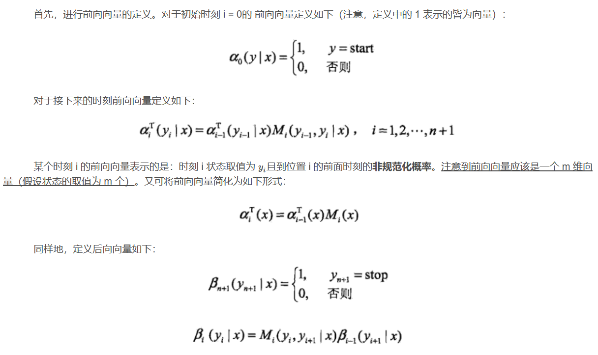

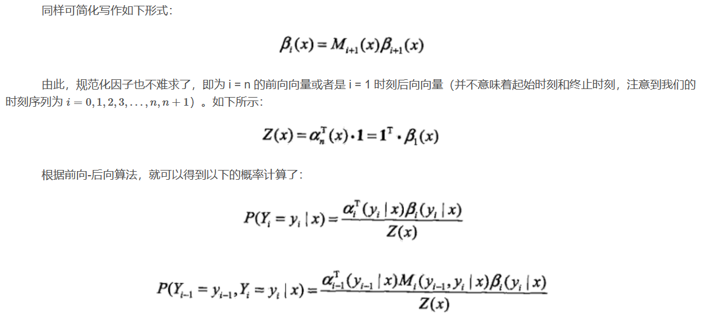

### 3.2 学习问题

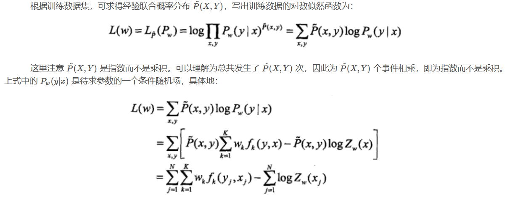

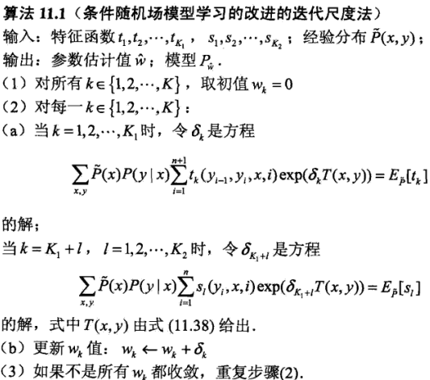

### 3.3 预测问题

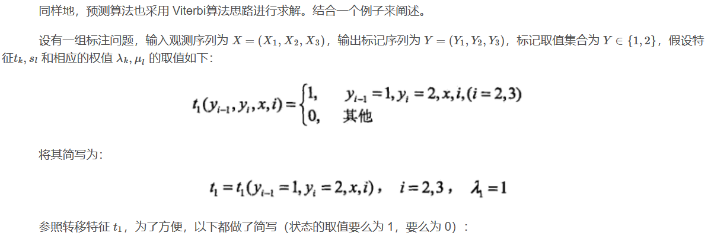

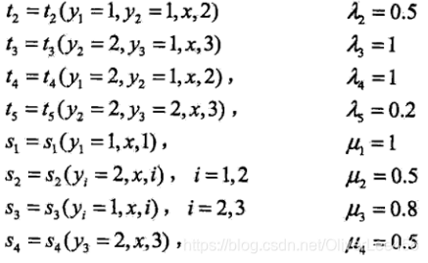

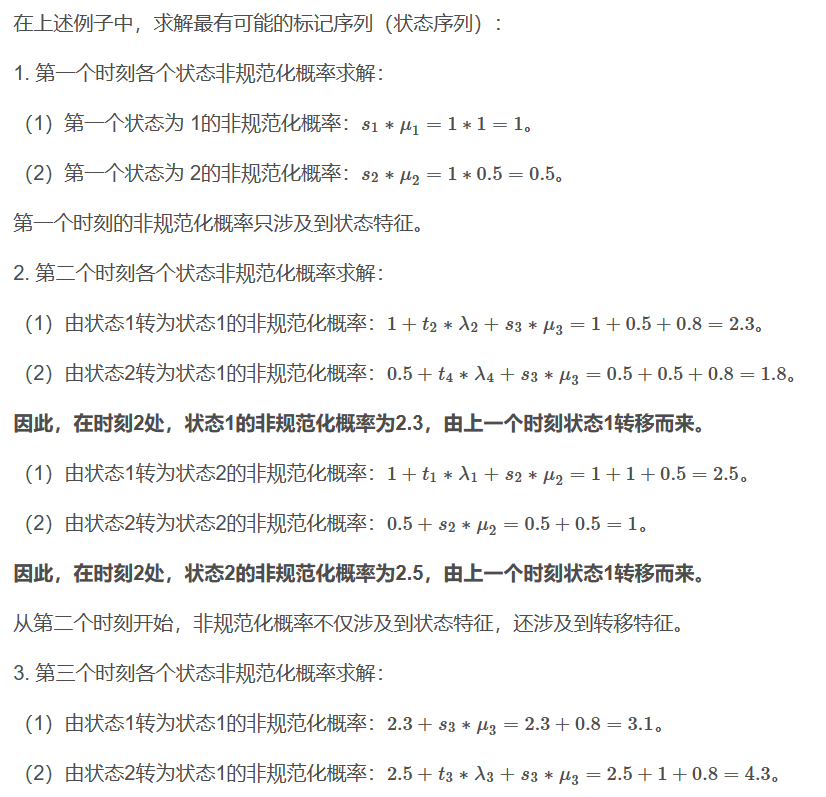

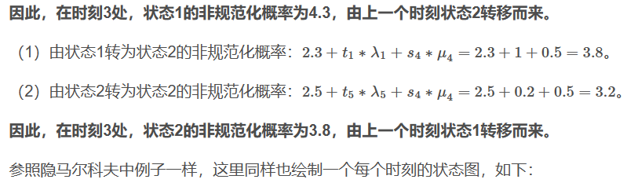

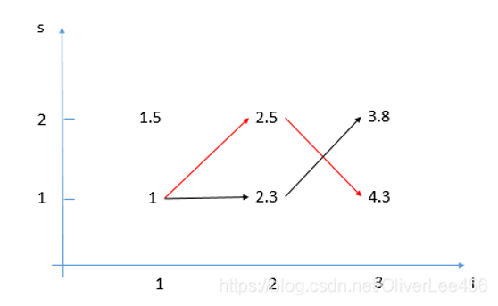

