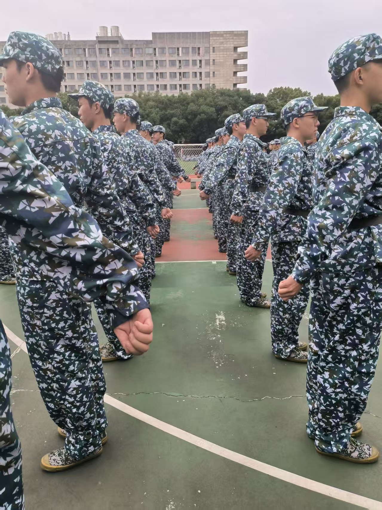
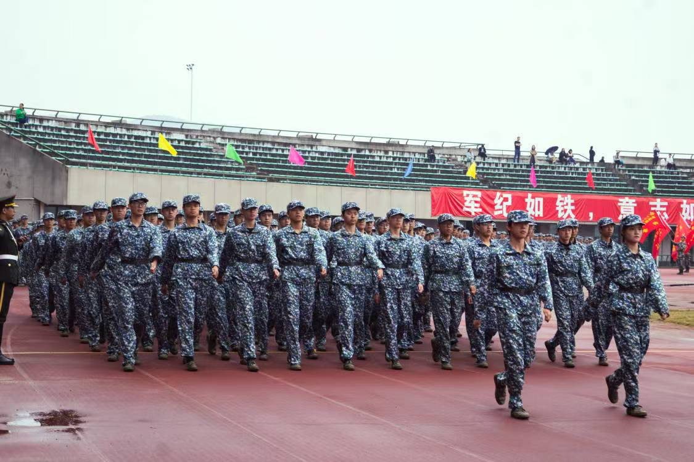
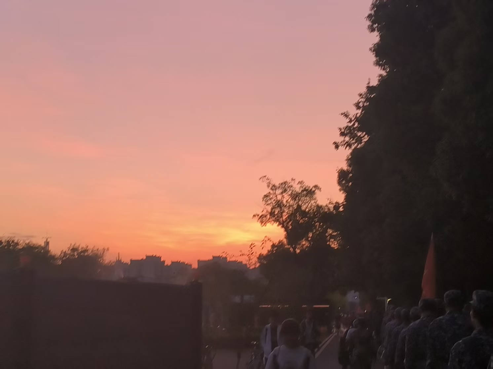
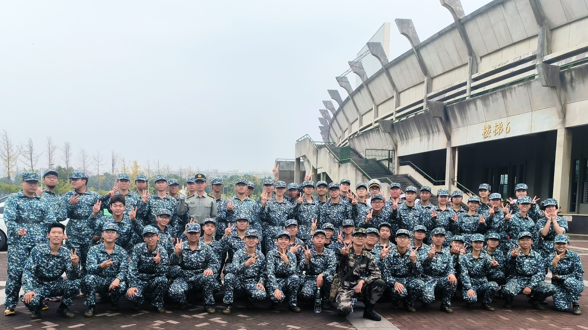

谨以此文，纪念这21天鲜明热烈的带训生活和我的小青蛙们。

领导发通知，要全体教官写一点带训的感想，本觉得形式主义，水点文字应付一下。突然想起来自己和小青蛙们讲的某些话，便打消了之前的念头，定定心心打开电脑开始写文章。忽又转念一想，感想嘛，写给领导看的，那肯定是要荡气回肠一点，宏大叙事一点，遂另起一篇，想着细水长流一些，写给自己，也写给青蛙们。

我常想着给自己立一个恶人的形象。把脸板起来，最好是凶神恶煞，目光所及，听不得一点蛙声。每每看到底下那一张张懵懵懂懂的脸，又狠不下那个心，只能放些狠话，吓一吓。说完又担心是不是过火了，又讲一些道理，到头来，狠倒是没狠起来几次，倒是成了最啰嗦的一个排长。

带训前我有时候会有点辗转反侧，自己心底里模拟，日后带训会出现什么情况，会有人不服从吗，会遇上什么突发状况吗，我又该怎么样去贯彻实行我的带训理念呢。一个好的思想，会影响人很久，有时候就是那么几句话，简单的，朴实的，没那么恢弘，但会真正地去根植在你的内心当中。想来想去，还是觉得我的排长教给我的四句话最是合适：为他人着想的善良，根植内心的修养，无需提醒的自觉，以约束为前提的自由。由此再继续往外阐发更多内容。前期我很想完完全全复刻我的排长是怎么教怎么做的，不过再往后，我想我已经走出了自己的一个风格，不同于他退役士兵的身份，面对自己的学弟学妹，我有更多东西和经验可以分享，也想让大家早点摆脱迷茫，在大学里找到一个适合自己的节奏。

正如前文提到的，我想去复刻我曾经的排长，他大了我三岁，比我们成熟很多，和我不在一个年龄段。轮到我当排长了，底下的小青蛙只比我小一岁，我尝试着把自己也放在一个不同的年龄段的层面上，“语重心长且苦口婆心”地去做思想工作，有时候想到一些合适的短语词句，我就想着拿出来，给大家当做思想激励。我一直认为，思想始终占领高地。军训工作中我把思想工作当成了最重要的一环，军训能带给大家的：集体意识，团结意识，吃苦耐劳精神，爱国主义情怀......有很多很多，我所希望的不是动作水平有多高，而在于能否影响到思想境界上。虽然这么讲有些模板俗套，但我真切希望大家都能成为鲁迅先生笔下能去发光发热的人。

（图一：齐步走原地摆臂练习）

21天压力和欣喜并存。压力一方面是源自自己，一方面是源自工作。10月底很不讨巧需要参加一个竞赛的复赛，白天要带训，晚上也有一些诸如查寝开会的事情，有点被弄得焦头烂额，时间总觉得不够用。带训压力也是有的，我毕竟没有参军入伍，和真正的退伍军人比起来，还是差得远了，回想去年带分列式的阵容，有两名退伍的教官，一作比较，压力还是挺大。犹记得那天我的排长来慰问我，也顺势看看我的训练成果，听着他的评价，心里有点五味杂陈，也给我紧了紧弦。脑海里也会萌生一些想法：作为第一届教官，没带出成绩，怎么办？忐忑和不安，有，一时的。每次看着底下的青蛙们，给他们打气，我也能被感染到，你们有信心，我也有。青蛙们也在一次次给我欣喜。二排的娃们拿了队列第一，很给我长脸；分列式的娃们也拿了学校的二等奖。付出，就会有回报，就和我说的一样：想到和得到之间，还有一个做到。我们能做到，那我们就得到。

（图二：分列式行进）

时常觉得，自己在被小青蛙们治愈着，也开始享受“陈排长”这个称呼。每天是很累，但看着小青蛙们还是觉得自己充满了活力。我没有学长学姐，但我有学弟学妹。

带训不只是我在教，我也在学，从小青蛙身上学，从其他排长身上学，从连长身上学。人总不能做到尽善尽美，但要尽量不留遗憾。

正如海明威说的，人不能同时拥有青春和对青春的感受。但我觉得，在我这个称得上还拥有着青春的年纪，也感受到了你们那样热烈美好的青春。感受是一瞬间的产物，是你们的杀声震天，是你们的排面标齐，是那一块大白兔奶糖，是我们带回路上的那一抹晚霞。但在某一天，也是一瞬，刹那就能化为永恒，那叫回忆。

（图三：带回路上的晚霞）

黑塞在书里写过：我所渴求的，无非是将心中脱颖欲出的本性付诸生活。这本书全名叫《德米安·彷徨少年时》。辜鸿铭曾说中国人骨子里有一种温良。我所渴求的，是能将这我们的这份本性，付诸生活和社会。都是少年，愿我们都能不再彷徨。

然后落落大方，人人如龙。

共勉。

（图四：十三连二排合影）

END

图：来自我的手机和小青蛙的相机

文：我

编辑：我
