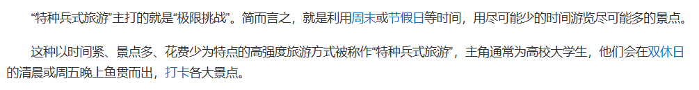

不知道从什么时候开始，突然冒出了这样一个名词“特种兵旅游”，对于这个名词的解释，一时间众说纷纭。于是我百度度一下得到了这个结果：  

嗯。

这个说法看着更理。  

突出的特点就是低成本、高强度，面向群体多为当代大学生。

日行三万步、辗转多个景点、几天几夜不睡觉......确实，这个运动量已经可以和特种兵们媲美了，故得名“特种兵旅游”。但是这个看似在“折磨自己”的一个行为，为什么会得到这么多人的青睐？

笔者认为这个原因还是可以从很多很多的地方着手的。

首先一个，疫情放开后的报复性出行。

新冠从我们这偷走了三年，三年以来，我们不能说走就走，哪儿哪儿都得做核酸，还得时时戴口罩。还好这样的日子一去不复返了，而被压抑已久的人们肯定要在这时开始出游。从这次五一火车高铁“一票难求”便可以看出。我好像还没经历过这种没抢到票的情景，没票可买应该出现在早些年的春运中，后者在地理角度可以去分析，但是前者，我很难想到除了“爆发式旅游”外还有什么理由能合理解释这次五一买票难的现象。（顺带吐槽一下就是因为这个我才在宿舍里码字）

嗯哼，这是目前的长沙现状：人人人人人人人人人人人人人人人人人人人

第二，自我释放。

收集了一些朋友对此的看法，我只能说每个人的动机都不一样：有追求刺激的，有觉得大家都在玩自己也试一试的，也有纯粹说走就出发了的......但有一种说法我觉得更为高度概括：压抑很久的自我释放。高中的时候啊，老听家长说，你现在辛苦一点吧，大学就轻松咯！但真到了大学，就发现：你被骗了！大学哪有想象里的那么轻松愉快，要干的事多了，要学的东西多了，要自己当心的事情多了......

高中语文老师说过一句话：目前是你最轻松的时候，你只管学，其他什么都不用管。此话不假。而在一个没有别人监督自己的环境里，需要有更多的精力放在自我约束上。而在QQ微信置顶群逐渐增多的时候，大学生们的精神状态也每况愈下。于是当代大学生总是戏称自己是蟑螂。

看腻了眼前的苟且，是时候捡起心里面那份诗和远方。

笔者也有过类似的经历：无数个ddl一起压过来，各种琐碎的事情堆起来，感觉喘不过气，但在和舍友去岳阳来了一次短暂的一日游之后，感觉自己又充满了活力。

还有一种理解，短暂的逃离。所有烦恼抛之脑后，什么ddl，什么表格，什么论文，什么人际关系，全都忘光，逃离这个学校，逃离这座城市，去到一个新的城市，邂逅新的风景，完完全全自我放空。我认为这是一种高级的发呆。个人认为，发呆是很有必要的，在我们这个年纪已经是想象力的荒漠了，我们需要daydream来填补想象力这一块的空缺。  

当然，什么事情都是有两面性的。

除了羡慕、赞同的声音之外，也有一些质疑、否定，而我们也要对“特种兵旅游”这个形式有一些更为客观的看法。

千篇一律、打卡式出行是“特种兵旅游”被诟病的地方。旅行应该是舒舒服服去感受去享受风景，而不是走马观花来一下就走。在一个高密度的旅行安排下，可能当事人也早已没有精力去真正享受观景的这一过程，因为再过一会可就赶不上下一个行程了。而所谓的“做攻略”，也就是在小红书等平台上将别人的行程所复刻了一遍。  

其实“特种兵”这一个词是有些调侃的意味在的，日行万步、不做停留也确实有种特种兵的风采。大家惊叹于这种出行形式的新奇，也抱着试一试的想法。但是演变到现在，大有变味的意思在。不乏有一些人盲目跟风，在一个怎么适合出行的时间、在计划安排爆满的情况下做出外出的决定，为的只是在朋友圈里展现自己“多彩”的生活。这时候，目的已经发生了本质上的变化，单纯为了展示而非体验。而有些喜欢揣测的人会认为这是一种对“年轻就是资本”的炫耀。

要是变成这样，旅行就从安安静静体验目的地的人文风景变成了包装个人社交资本的任务。

可旅游并不是打卡。  

于是，特种兵旅游好像在我这变成了两种定义：第一种，指的是光速打卡完景点、小吃随后返校；第二种，指的是，在时间轴不变的前提下，来到某个目的地深度体验。

笔者认为，或许后者才是特种兵旅游最原始的样子：仅仅只是在一个相对短的时间内完成一次出游（一天、一天半），并且不影响后续的工作学习。经历了不断的演变之后，人们在“完成一次出游”中，不断地内卷（不是，这也能卷啊？），你一天三万步，那我就要一天逛十个景点；你两天玩了两个城，那我就三天吃遍一个省。

然后，人们渐渐忘记了为什么旅行。虽然也还没走很久，但也忘了为什么出发。

本是为了放松，但在高强度的出行后，身心更加疲惫不说，钱包也在这一大堆的景点里逐渐空虚，短时间的打卡甚至没法值回票价。  

之前去了趟岳阳，我也戏称自己是特种兵出行：起个大早，但还是差点没赶上车，四个人在地铁站狂奔，一到车上倒头就睡。接下来，我们骑着车去看洞庭湖，踱着步在岳阳楼逛，很慢，在一个景点待了很久，但是很惬意很满足。吃个晚饭又在宿舍关门前回到了寝室。累？没觉得。钱？主要花在车票上。我们也算在短时间内完成了一次圆满的出行，但确确实实在身体和心理上都得到了治愈。

“特种兵旅游”是时势造就的，某种意义上来说它的出现是必然的，内卷导致压力倍增、时间金钱两头紧张，疫情放开又推了一把，这才促使了“特种兵旅行”的火爆。回想去年封校时这么多爬行的大学生，这会儿放开了趁现在去挥洒青春也是情有可原。当然这都建立在量力而行的前提下，仅仅只为了丰富一下自己的朋友圈而去燃烧青春和金钱那也大可不必，大可以放在其他地方。还是一点：盲目跟风不可取。更何况，或许经济进一步复苏之后，这种形式的出游将渐渐消失不见。  

毕竟真正的诗和远方，可不用着燃烧生命，有时候从一抹日出、一缕晚霞中你也能看见它。

“旅行者，当你重新踏上旅途之后，一定要记得旅途本身的意义。提瓦特的飞鸟、诗歌和城邦，女皇、愚人和怪物……都是你旅途的一部分。终点并不意味着一切。在抵达终点之前，用你的眼睛，多多观察这个世界吧。”

写在最后：

如果我说我其实早就写好了就是一直忘记发了，你信吗？  

END
